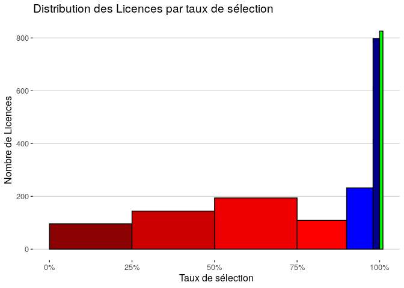

Jeu de données : [Parcoursup vœux de poursuite d’études et de réorientation dans l’enseignement supérieur et réponses des établissements](https://www.data.gouv.fr/fr/datasets/parcoursup-voeux-de-poursuite-detudes-et-de-reorientation-dans-lenseignement-superieur-et-reponses-des-etablissements/)

Ce jeu de données ne permet pas de percevoir les choses du côté des candidats : contrairement à ce que laisse en titre, il ne contient pas les vœux des candidats, mais seulement le nombre candidatures aux formations. 

Il permet en revanche de percevoir les choses du côté des formations.

## Statistiques nationales

<!-- -->


<!-- -->

<!-- -->


```
## Warning: Removed 548 rows containing non-finite values (stat_density).
```

<!-- -->


## Taux de tension

Le taux de tension est défini comme le rapport entre le nombre de candidatures, et les capacités d'accueil :

$tension=\frac{candidatures}{capacité}$

Limite : une formation "choix de secours" peut apparaitre en tension avec un très grand nombre de candidatures initiales, mais tout autant de désistements.

<!-- -->


```
## Warning: Removed 620 rows containing non-finite values (stat_density).
```

<!-- -->


<!-- -->


### Filières non sélectives (Licences) en tension

La Loi ORE dispose que : "lorsque le nombre de candidatures excède les capacités d'accueil d'une formation, les inscriptions sont prononcées par le président ou le directeur de l'établissement dans la limite des capacités d'accueil".

La proportion de Licences dites "en tension" selon cette définition est :

<!-- -->

## Taux de remplissage

Le taux de remplissage est défini comme le rapport entre le nombre de cadnidats admis et les capacités d'accueil :

$remplissage=\frac{admis}{capacité}$


<!-- -->


```
## Warning: Removed 38 rows containing non-finite values (stat_density).
```

<!-- -->

<!-- -->


### Top 10

<table>
 <thead>
  <tr>
   <th style="text-align:left;"> Établissement </th>
   <th style="text-align:left;"> CP </th>
   <th style="text-align:left;"> Type </th>
   <th style="text-align:left;"> Filière </th>
   <th style="text-align:right;"> Capacité </th>
   <th style="text-align:right;"> Admis.phase.principale </th>
   <th style="text-align:right;"> Admis.phase.comp </th>
   <th style="text-align:right;"> Taux.de.remplissage </th>
  </tr>
 </thead>
<tbody>
  <tr>
   <td style="text-align:left;"> Université Lumière-Lyon 2 </td>
   <td style="text-align:left;"> 69 </td>
   <td style="text-align:left;"> Licence </td>
   <td style="text-align:left;"> Langues étrangères appliquées </td>
   <td style="text-align:right;"> 15 </td>
   <td style="text-align:right;"> 58 </td>
   <td style="text-align:right;"> 0 </td>
   <td style="text-align:right;"> 3.866667 </td>
  </tr>
  <tr>
   <td style="text-align:left;"> Université Lumière-Lyon 2 </td>
   <td style="text-align:left;"> 69 </td>
   <td style="text-align:left;"> Licence </td>
   <td style="text-align:left;"> Mathématiques et informatique appliquées aux sciences humaines et sociales </td>
   <td style="text-align:right;"> 160 </td>
   <td style="text-align:right;"> 377 </td>
   <td style="text-align:right;"> 0 </td>
   <td style="text-align:right;"> 2.356250 </td>
  </tr>
  <tr>
   <td style="text-align:left;"> Université de la Réunion - Le Tampon </td>
   <td style="text-align:left;"> 974 </td>
   <td style="text-align:left;"> Licence </td>
   <td style="text-align:left;"> Sciences pour la santé </td>
   <td style="text-align:right;"> 120 </td>
   <td style="text-align:right;"> 131 </td>
   <td style="text-align:right;"> 112 </td>
   <td style="text-align:right;"> 2.025000 </td>
  </tr>
  <tr>
   <td style="text-align:left;"> Université Lumière-Lyon 2 </td>
   <td style="text-align:left;"> 69 </td>
   <td style="text-align:left;"> Licence </td>
   <td style="text-align:left;"> Langues étrangères appliquées </td>
   <td style="text-align:right;"> 30 </td>
   <td style="text-align:right;"> 59 </td>
   <td style="text-align:right;"> 0 </td>
   <td style="text-align:right;"> 1.966667 </td>
  </tr>
  <tr>
   <td style="text-align:left;"> Université des Antilles - Pôle Guadeloupe </td>
   <td style="text-align:left;"> 971 </td>
   <td style="text-align:left;"> Licence </td>
   <td style="text-align:left;"> Administration publique </td>
   <td style="text-align:right;"> 20 </td>
   <td style="text-align:right;"> 39 </td>
   <td style="text-align:right;"> 0 </td>
   <td style="text-align:right;"> 1.950000 </td>
  </tr>
  <tr>
   <td style="text-align:left;"> Université de La Réunion - Saint Denis </td>
   <td style="text-align:left;"> 974 </td>
   <td style="text-align:left;"> Licence </td>
   <td style="text-align:left;"> Histoire </td>
   <td style="text-align:right;"> 90 </td>
   <td style="text-align:right;"> 103 </td>
   <td style="text-align:right;"> 70 </td>
   <td style="text-align:right;"> 1.922222 </td>
  </tr>
  <tr>
   <td style="text-align:left;"> Lycée Henri Martin </td>
   <td style="text-align:left;"> 02 </td>
   <td style="text-align:left;"> BTS </td>
   <td style="text-align:left;"> Métiers de l'audio-visuel opt : montage et post-production </td>
   <td style="text-align:right;"> 15 </td>
   <td style="text-align:right;"> 24 </td>
   <td style="text-align:right;"> 0 </td>
   <td style="text-align:right;"> 1.800000 </td>
  </tr>
  <tr>
   <td style="text-align:left;"> Université de La Réunion - Saint Denis </td>
   <td style="text-align:left;"> 974 </td>
   <td style="text-align:left;"> Licence </td>
   <td style="text-align:left;"> Sciences sociales </td>
   <td style="text-align:right;"> 160 </td>
   <td style="text-align:right;"> 180 </td>
   <td style="text-align:right;"> 104 </td>
   <td style="text-align:right;"> 1.775000 </td>
  </tr>
  <tr>
   <td style="text-align:left;"> Université Lumière-Lyon 2 </td>
   <td style="text-align:left;"> 69 </td>
   <td style="text-align:left;"> Licence </td>
   <td style="text-align:left;"> Langues étrangères appliquées </td>
   <td style="text-align:right;"> 130 </td>
   <td style="text-align:right;"> 229 </td>
   <td style="text-align:right;"> 0 </td>
   <td style="text-align:right;"> 1.761538 </td>
  </tr>
  <tr>
   <td style="text-align:left;"> Université de Poitiers </td>
   <td style="text-align:left;"> 86 </td>
   <td style="text-align:left;"> Licence </td>
   <td style="text-align:left;"> Langues, littératures &amp; civilisations étrangères et régionales </td>
   <td style="text-align:right;"> 20 </td>
   <td style="text-align:right;"> 34 </td>
   <td style="text-align:right;"> 0 </td>
   <td style="text-align:right;"> 1.700000 </td>
  </tr>
</tbody>
</table>

### Bottom 10

<table>
 <thead>
  <tr>
   <th style="text-align:left;"> Établissement </th>
   <th style="text-align:left;"> CP </th>
   <th style="text-align:left;"> Type </th>
   <th style="text-align:left;"> Filière </th>
   <th style="text-align:right;"> Capacité </th>
   <th style="text-align:right;"> Admis.phase.principale </th>
   <th style="text-align:right;"> Admis.phase.comp </th>
   <th style="text-align:right;"> Taux.de.remplissage </th>
  </tr>
 </thead>
<tbody>
  <tr>
   <td style="text-align:left;"> INALCO </td>
   <td style="text-align:left;"> 75 </td>
   <td style="text-align:left;"> Licence </td>
   <td style="text-align:left;"> Langues, littératures &amp; civilisations étrangères et régionales </td>
   <td style="text-align:right;"> 55 </td>
   <td style="text-align:right;"> 0 </td>
   <td style="text-align:right;"> 0 </td>
   <td style="text-align:right;"> 0 </td>
  </tr>
  <tr>
   <td style="text-align:left;"> Université Paris 8 </td>
   <td style="text-align:left;"> 93 </td>
   <td style="text-align:left;"> Licence </td>
   <td style="text-align:left;"> Langues étrangères appliquées </td>
   <td style="text-align:right;"> 25 </td>
   <td style="text-align:right;"> 0 </td>
   <td style="text-align:right;"> 0 </td>
   <td style="text-align:right;"> 0 </td>
  </tr>
  <tr>
   <td style="text-align:left;"> Lycée Saint Leon </td>
   <td style="text-align:left;"> 91 </td>
   <td style="text-align:left;"> CPGE </td>
   <td style="text-align:left;"> PTSI </td>
   <td style="text-align:right;"> 45 </td>
   <td style="text-align:right;"> 0 </td>
   <td style="text-align:right;"> 0 </td>
   <td style="text-align:right;"> 0 </td>
  </tr>
  <tr>
   <td style="text-align:left;"> Université Paris- Est-Créteil Val de Marne - UPEC (Paris 12) </td>
   <td style="text-align:left;"> 94 </td>
   <td style="text-align:left;"> Licence </td>
   <td style="text-align:left;"> Langues, littératures &amp; civilisations étrangères et régionales </td>
   <td style="text-align:right;"> 50 </td>
   <td style="text-align:right;"> 0 </td>
   <td style="text-align:right;"> 0 </td>
   <td style="text-align:right;"> 0 </td>
  </tr>
  <tr>
   <td style="text-align:left;"> Université de Bourgogne - site de Dijon </td>
   <td style="text-align:left;"> 21 </td>
   <td style="text-align:left;"> Licence </td>
   <td style="text-align:left;"> Philosophie </td>
   <td style="text-align:right;"> 2 </td>
   <td style="text-align:right;"> 0 </td>
   <td style="text-align:right;"> 0 </td>
   <td style="text-align:right;"> 0 </td>
  </tr>
  <tr>
   <td style="text-align:left;"> Université Paris 8 </td>
   <td style="text-align:left;"> 93 </td>
   <td style="text-align:left;"> Licence </td>
   <td style="text-align:left;"> Langues étrangères appliquées </td>
   <td style="text-align:right;"> 25 </td>
   <td style="text-align:right;"> 0 </td>
   <td style="text-align:right;"> 0 </td>
   <td style="text-align:right;"> 0 </td>
  </tr>
  <tr>
   <td style="text-align:left;"> Université Paris 8 </td>
   <td style="text-align:left;"> 93 </td>
   <td style="text-align:left;"> Licence </td>
   <td style="text-align:left;"> Langues étrangères appliquées </td>
   <td style="text-align:right;"> 25 </td>
   <td style="text-align:right;"> 0 </td>
   <td style="text-align:right;"> 0 </td>
   <td style="text-align:right;"> 0 </td>
  </tr>
  <tr>
   <td style="text-align:left;"> INALCO </td>
   <td style="text-align:left;"> 75 </td>
   <td style="text-align:left;"> Licence </td>
   <td style="text-align:left;"> Langues, littératures &amp; civilisations étrangères et régionales </td>
   <td style="text-align:right;"> 55 </td>
   <td style="text-align:right;"> 0 </td>
   <td style="text-align:right;"> 0 </td>
   <td style="text-align:right;"> 0 </td>
  </tr>
  <tr>
   <td style="text-align:left;"> Université d'Orléans </td>
   <td style="text-align:left;"> 45 </td>
   <td style="text-align:left;"> Licence </td>
   <td style="text-align:left;"> Physique </td>
   <td style="text-align:right;"> 125 </td>
   <td style="text-align:right;"> 0 </td>
   <td style="text-align:right;"> 0 </td>
   <td style="text-align:right;"> 0 </td>
  </tr>
  <tr>
   <td style="text-align:left;"> Institut Catholique Paris </td>
   <td style="text-align:left;"> 75 </td>
   <td style="text-align:left;"> Licence </td>
   <td style="text-align:left;"> Langues, littératures &amp; civilisations étrangères et régionales </td>
   <td style="text-align:right;"> 30 </td>
   <td style="text-align:right;"> 0 </td>
   <td style="text-align:right;"> 0 </td>
   <td style="text-align:right;"> 0 </td>
  </tr>
</tbody>
</table>

## Taux de sélection

Le taux de sélection est défini comme le rapport entre le nombre d'appelés (admis ou non), et le nombre de candidats en phase principale :

$sélection=\frac{rang.du.dernier.appelé}{candidats}$

Interprétation : un taux de sélection de 100% signifie que tous les candidats ont été appelés. Plus le taux est bas, plus la formation est sélective. 


```
## Warning: Removed 4694 rows containing non-finite values (stat_boxplot).
```

<!-- -->


```
## Warning: Removed 4694 rows containing non-finite values (stat_density).
```

<!-- -->


### Top 10

<table>
 <thead>
  <tr>
   <th style="text-align:left;"> Établissement </th>
   <th style="text-align:left;"> CP </th>
   <th style="text-align:left;"> Type </th>
   <th style="text-align:left;"> Filière </th>
   <th style="text-align:right;"> Capacité </th>
   <th style="text-align:right;"> Candidats </th>
   <th style="text-align:right;"> Rang.du.dernier.appelé </th>
   <th style="text-align:right;"> Taux.de.sélection </th>
  </tr>
 </thead>
<tbody>
  <tr>
   <td style="text-align:left;"> Lycée Leonard de Vinci </td>
   <td style="text-align:left;"> 85 </td>
   <td style="text-align:left;"> BTS </td>
   <td style="text-align:left;"> Métiers de l'audio-visuel opt : métiers de l'image </td>
   <td style="text-align:right;"> 8 </td>
   <td style="text-align:right;"> 981 </td>
   <td style="text-align:right;"> 10 </td>
   <td style="text-align:right;"> 0.0101937 </td>
  </tr>
  <tr>
   <td style="text-align:left;"> Lycée Leonard de Vinci </td>
   <td style="text-align:left;"> 85 </td>
   <td style="text-align:left;"> BTS </td>
   <td style="text-align:left;"> Métiers de l'audio-visuel opt : montage et post-production </td>
   <td style="text-align:right;"> 8 </td>
   <td style="text-align:right;"> 969 </td>
   <td style="text-align:right;"> 11 </td>
   <td style="text-align:right;"> 0.0113519 </td>
  </tr>
  <tr>
   <td style="text-align:left;"> Lycée Carnot </td>
   <td style="text-align:left;"> 06 </td>
   <td style="text-align:left;"> BTS </td>
   <td style="text-align:left;"> Métiers de l'audio-visuel opt : métiers du son </td>
   <td style="text-align:right;"> 8 </td>
   <td style="text-align:right;"> 732 </td>
   <td style="text-align:right;"> 12 </td>
   <td style="text-align:right;"> 0.0163934 </td>
  </tr>
  <tr>
   <td style="text-align:left;"> Lycée Leonard de Vinci </td>
   <td style="text-align:left;"> 85 </td>
   <td style="text-align:left;"> BTS </td>
   <td style="text-align:left;"> Métiers de l'audio-visuel opt : métiers du son </td>
   <td style="text-align:right;"> 8 </td>
   <td style="text-align:right;"> 729 </td>
   <td style="text-align:right;"> 15 </td>
   <td style="text-align:right;"> 0.0205761 </td>
  </tr>
  <tr>
   <td style="text-align:left;"> Lycée Carnot </td>
   <td style="text-align:left;"> 06 </td>
   <td style="text-align:left;"> BTS </td>
   <td style="text-align:left;"> Métiers de l'audio-visuel opt : métiers de l'image </td>
   <td style="text-align:right;"> 8 </td>
   <td style="text-align:right;"> 1066 </td>
   <td style="text-align:right;"> 22 </td>
   <td style="text-align:right;"> 0.0206379 </td>
  </tr>
  <tr>
   <td style="text-align:left;"> Lycée Edouard Branly </td>
   <td style="text-align:left;"> 69 </td>
   <td style="text-align:left;"> BTS </td>
   <td style="text-align:left;"> Systèmes numériques - Option informatique et réseaux </td>
   <td style="text-align:right;"> 2 </td>
   <td style="text-align:right;"> 140 </td>
   <td style="text-align:right;"> 3 </td>
   <td style="text-align:right;"> 0.0214286 </td>
  </tr>
  <tr>
   <td style="text-align:left;"> Lycée Henri IV </td>
   <td style="text-align:left;"> 75 </td>
   <td style="text-align:left;"> CPGE </td>
   <td style="text-align:left;"> Option économique - Prépa St Cyr </td>
   <td style="text-align:right;"> 2 </td>
   <td style="text-align:right;"> 180 </td>
   <td style="text-align:right;"> 4 </td>
   <td style="text-align:right;"> 0.0222222 </td>
  </tr>
  <tr>
   <td style="text-align:left;"> Lycée Carnot </td>
   <td style="text-align:left;"> 06 </td>
   <td style="text-align:left;"> BTS </td>
   <td style="text-align:left;"> Métiers de l'audio-visuel opt : montage et post-production </td>
   <td style="text-align:right;"> 8 </td>
   <td style="text-align:right;"> 935 </td>
   <td style="text-align:right;"> 23 </td>
   <td style="text-align:right;"> 0.0245989 </td>
  </tr>
  <tr>
   <td style="text-align:left;"> I.U.T. 2 de Grenoble </td>
   <td style="text-align:left;"> 38 </td>
   <td style="text-align:left;"> DUT </td>
   <td style="text-align:left;"> Carrières sociales Option éducation spécialisée </td>
   <td style="text-align:right;"> 28 </td>
   <td style="text-align:right;"> 1382 </td>
   <td style="text-align:right;"> 46 </td>
   <td style="text-align:right;"> 0.0332851 </td>
  </tr>
  <tr>
   <td style="text-align:left;"> Lycée Edouard Branly </td>
   <td style="text-align:left;"> 69 </td>
   <td style="text-align:left;"> BTS </td>
   <td style="text-align:left;"> Electrotechnique </td>
   <td style="text-align:right;"> 2 </td>
   <td style="text-align:right;"> 85 </td>
   <td style="text-align:right;"> 3 </td>
   <td style="text-align:right;"> 0.0352941 </td>
  </tr>
</tbody>
</table>

### Bottom 10

<table>
 <thead>
  <tr>
   <th style="text-align:left;"> Établissement </th>
   <th style="text-align:left;"> CP </th>
   <th style="text-align:left;"> Type </th>
   <th style="text-align:left;"> Filière </th>
   <th style="text-align:right;"> Capacité </th>
   <th style="text-align:right;"> Candidats </th>
   <th style="text-align:right;"> Rang.du.dernier.appelé </th>
   <th style="text-align:right;"> Taux.de.sélection </th>
  </tr>
 </thead>
<tbody>
  <tr>
   <td style="text-align:left;"> Université Jean Moulin Lyon 3 </td>
   <td style="text-align:left;"> 69 </td>
   <td style="text-align:left;"> Licence </td>
   <td style="text-align:left;"> Langues étrangères appliquées </td>
   <td style="text-align:right;"> 28 </td>
   <td style="text-align:right;"> 32 </td>
   <td style="text-align:right;"> 32 </td>
   <td style="text-align:right;"> 1 </td>
  </tr>
  <tr>
   <td style="text-align:left;"> Lycée AMEP </td>
   <td style="text-align:left;"> 972 </td>
   <td style="text-align:left;"> BTS </td>
   <td style="text-align:left;"> Fluide, énergie, domotique - option C domotique et bâtiment communicants </td>
   <td style="text-align:right;"> 25 </td>
   <td style="text-align:right;"> 43 </td>
   <td style="text-align:right;"> 43 </td>
   <td style="text-align:right;"> 1 </td>
  </tr>
  <tr>
   <td style="text-align:left;"> CNED </td>
   <td style="text-align:left;"> 38 </td>
   <td style="text-align:left;"> BTS </td>
   <td style="text-align:left;"> Systèmes numériques - Option électronique et communication </td>
   <td style="text-align:right;"> 200 </td>
   <td style="text-align:right;"> 69 </td>
   <td style="text-align:right;"> 69 </td>
   <td style="text-align:right;"> 1 </td>
  </tr>
  <tr>
   <td style="text-align:left;"> Université d'Orléans </td>
   <td style="text-align:left;"> 45 </td>
   <td style="text-align:left;"> Licence </td>
   <td style="text-align:left;"> Physique </td>
   <td style="text-align:right;"> 125 </td>
   <td style="text-align:right;"> 34 </td>
   <td style="text-align:right;"> 34 </td>
   <td style="text-align:right;"> 1 </td>
  </tr>
  <tr>
   <td style="text-align:left;"> Université Paris Nanterre </td>
   <td style="text-align:left;"> 92 </td>
   <td style="text-align:left;"> Licence </td>
   <td style="text-align:left;"> Langues, littératures &amp; civilisations étrangères et régionales </td>
   <td style="text-align:right;"> 39 </td>
   <td style="text-align:right;"> 104 </td>
   <td style="text-align:right;"> 104 </td>
   <td style="text-align:right;"> 1 </td>
  </tr>
  <tr>
   <td style="text-align:left;"> Université Lumière-Lyon 2 </td>
   <td style="text-align:left;"> 69 </td>
   <td style="text-align:left;"> Licence </td>
   <td style="text-align:left;"> Sciences sociales </td>
   <td style="text-align:right;"> 300 </td>
   <td style="text-align:right;"> 2682 </td>
   <td style="text-align:right;"> 2682 </td>
   <td style="text-align:right;"> 1 </td>
  </tr>
  <tr>
   <td style="text-align:left;"> Université de Cergy-Pontoise </td>
   <td style="text-align:left;"> 95 </td>
   <td style="text-align:left;"> Licence </td>
   <td style="text-align:left;"> Lettres </td>
   <td style="text-align:right;"> 170 </td>
   <td style="text-align:right;"> 397 </td>
   <td style="text-align:right;"> 397 </td>
   <td style="text-align:right;"> 1 </td>
  </tr>
  <tr>
   <td style="text-align:left;"> Aix Marseille Université - site d'Aix-en-Provence </td>
   <td style="text-align:left;"> 13 </td>
   <td style="text-align:left;"> Licence </td>
   <td style="text-align:left;"> Langues, littératures &amp; civilisations étrangères et régionales </td>
   <td style="text-align:right;"> 20 </td>
   <td style="text-align:right;"> 22 </td>
   <td style="text-align:right;"> 22 </td>
   <td style="text-align:right;"> 1 </td>
  </tr>
  <tr>
   <td style="text-align:left;"> Université Jean Moulin Lyon 3 </td>
   <td style="text-align:left;"> 69 </td>
   <td style="text-align:left;"> Licence </td>
   <td style="text-align:left;"> Langues étrangères appliquées </td>
   <td style="text-align:right;"> 35 </td>
   <td style="text-align:right;"> 140 </td>
   <td style="text-align:right;"> 140 </td>
   <td style="text-align:right;"> 1 </td>
  </tr>
  <tr>
   <td style="text-align:left;"> Université Jean Moulin Lyon 3 </td>
   <td style="text-align:left;"> 69 </td>
   <td style="text-align:left;"> Licence </td>
   <td style="text-align:left;"> Philosophie </td>
   <td style="text-align:right;"> 105 </td>
   <td style="text-align:right;"> 725 </td>
   <td style="text-align:right;"> 725 </td>
   <td style="text-align:right;"> 1 </td>
  </tr>
</tbody>
</table>

### Filières non-sélectives (Licences)


```
## Warning: Removed 35 rows containing non-finite values (stat_bin).
```

<!-- -->

Attention : le nombre de formations ayant un unique candidat non-appelé est surreprésenté. De plus amples investigations sont nécessaires. Dans la suite, les filières sont considérées comme sélectives dès lors qu'au moins 2 candidats sont restés en file d'attente à la fin de la procédure.

<!-- -->


<table>
 <thead>
  <tr>
   <th style="text-align:left;"> Établissement </th>
   <th style="text-align:left;"> CP </th>
   <th style="text-align:left;"> Type </th>
   <th style="text-align:left;"> Filière </th>
   <th style="text-align:right;"> Capacité </th>
   <th style="text-align:right;"> Candidats </th>
   <th style="text-align:right;"> Rang.du.dernier.appelé </th>
   <th style="text-align:right;"> Taux.de.sélection </th>
  </tr>
 </thead>
<tbody>
  <tr>
   <td style="text-align:left;"> Université Paris-Sud, campus d'Orsay </td>
   <td style="text-align:left;"> 91 </td>
   <td style="text-align:left;"> Licence </td>
   <td style="text-align:left;"> Sciences pour l'ingénieur </td>
   <td style="text-align:right;"> 30 </td>
   <td style="text-align:right;"> 1360 </td>
   <td style="text-align:right;"> 51 </td>
   <td style="text-align:right;"> 0.0375000 </td>
  </tr>
  <tr>
   <td style="text-align:left;"> Université Paris- Est- Créteil Val de Marne UPEC - Antenne de Sénart </td>
   <td style="text-align:left;"> 77 </td>
   <td style="text-align:left;"> Licence </td>
   <td style="text-align:left;"> Economie et gestion </td>
   <td style="text-align:right;"> 32 </td>
   <td style="text-align:right;"> 1057 </td>
   <td style="text-align:right;"> 48 </td>
   <td style="text-align:right;"> 0.0454115 </td>
  </tr>
  <tr>
   <td style="text-align:left;"> Université Paris 1 Panthéon Sorbonne </td>
   <td style="text-align:left;"> 75 </td>
   <td style="text-align:left;"> Licence </td>
   <td style="text-align:left;"> Droit </td>
   <td style="text-align:right;"> 25 </td>
   <td style="text-align:right;"> 726 </td>
   <td style="text-align:right;"> 35 </td>
   <td style="text-align:right;"> 0.0482094 </td>
  </tr>
  <tr>
   <td style="text-align:left;"> Université Paris 1 Panthéon Sorbonne </td>
   <td style="text-align:left;"> 75 </td>
   <td style="text-align:left;"> Licence </td>
   <td style="text-align:left;"> Science politique </td>
   <td style="text-align:right;"> 65 </td>
   <td style="text-align:right;"> 6556 </td>
   <td style="text-align:right;"> 363 </td>
   <td style="text-align:right;"> 0.0553691 </td>
  </tr>
  <tr>
   <td style="text-align:left;"> Université Paris- Est-Créteil Val de Marne - UPEC (Paris 12) </td>
   <td style="text-align:left;"> 94 </td>
   <td style="text-align:left;"> Licence </td>
   <td style="text-align:left;"> Economie et gestion </td>
   <td style="text-align:right;"> 30 </td>
   <td style="text-align:right;"> 1245 </td>
   <td style="text-align:right;"> 71 </td>
   <td style="text-align:right;"> 0.0570281 </td>
  </tr>
  <tr>
   <td style="text-align:left;"> Universite de Lille - Campus Moulin Ronchin - Lille </td>
   <td style="text-align:left;"> 59 </td>
   <td style="text-align:left;"> Licence </td>
   <td style="text-align:left;"> Sciences et Techniques des Activités Physiques et Sportives </td>
   <td style="text-align:right;"> 15 </td>
   <td style="text-align:right;"> 285 </td>
   <td style="text-align:right;"> 17 </td>
   <td style="text-align:right;"> 0.0596491 </td>
  </tr>
  <tr>
   <td style="text-align:left;"> Université de Lille - Campus Pont de Bois - Villeneuve d'Ascq </td>
   <td style="text-align:left;"> 59 </td>
   <td style="text-align:left;"> Licence </td>
   <td style="text-align:left;"> Economie et gestion </td>
   <td style="text-align:right;"> 25 </td>
   <td style="text-align:right;"> 525 </td>
   <td style="text-align:right;"> 32 </td>
   <td style="text-align:right;"> 0.0609524 </td>
  </tr>
  <tr>
   <td style="text-align:left;"> IPC-Facultés Libres de Philosophie et de Psycholog </td>
   <td style="text-align:left;"> 75 </td>
   <td style="text-align:left;"> Licence </td>
   <td style="text-align:left;"> Psychologie </td>
   <td style="text-align:right;"> 20 </td>
   <td style="text-align:right;"> 632 </td>
   <td style="text-align:right;"> 41 </td>
   <td style="text-align:right;"> 0.0648734 </td>
  </tr>
  <tr>
   <td style="text-align:left;"> Université de Bordeaux - Bordeaux Métropole </td>
   <td style="text-align:left;"> 33 </td>
   <td style="text-align:left;"> Licence </td>
   <td style="text-align:left;"> Droit </td>
   <td style="text-align:right;"> 90 </td>
   <td style="text-align:right;"> 2016 </td>
   <td style="text-align:right;"> 135 </td>
   <td style="text-align:right;"> 0.0669643 </td>
  </tr>
  <tr>
   <td style="text-align:left;"> Université Paris 2 Panthéon - Assas </td>
   <td style="text-align:left;"> 75 </td>
   <td style="text-align:left;"> Licence </td>
   <td style="text-align:left;"> Information et communication </td>
   <td style="text-align:right;"> 50 </td>
   <td style="text-align:right;"> 5408 </td>
   <td style="text-align:right;"> 370 </td>
   <td style="text-align:right;"> 0.0684172 </td>
  </tr>
</tbody>
</table>


### Par établissements

Le taux de Licences sélective est défini comme le rapport entre le nombre de Licences sélectives, et le nombre total de Licences.


```
## Warning: Removed 76 rows containing non-finite values (stat_density).
```

<!-- -->

### Top 10  
  
<table>
 <thead>
  <tr>
   <th style="text-align:left;"> Établissement </th>
   <th style="text-align:right;"> Nb.L </th>
   <th style="text-align:right;"> Nb.L.Sélectives </th>
   <th style="text-align:right;"> Taux.L.sél </th>
   <th style="text-align:right;"> Taux.sél.moyen </th>
  </tr>
 </thead>
<tbody>
  <tr>
   <td style="text-align:left;"> Université Paris 1 Panthéon Sorbonne </td>
   <td style="text-align:right;"> 35 </td>
   <td style="text-align:right;"> 34 </td>
   <td style="text-align:right;"> 0.9714286 </td>
   <td style="text-align:right;"> 0.4785086 </td>
  </tr>
  <tr>
   <td style="text-align:left;"> Université de Rennes 1 </td>
   <td style="text-align:right;"> 14 </td>
   <td style="text-align:right;"> 13 </td>
   <td style="text-align:right;"> 0.9285714 </td>
   <td style="text-align:right;"> 0.7409422 </td>
  </tr>
  <tr>
   <td style="text-align:left;"> Université de Bordeaux - Bordeaux Métropole </td>
   <td style="text-align:right;"> 22 </td>
   <td style="text-align:right;"> 20 </td>
   <td style="text-align:right;"> 0.9090909 </td>
   <td style="text-align:right;"> 0.6207313 </td>
  </tr>
  <tr>
   <td style="text-align:left;"> Université Paris-Est Marne-la-Vallée </td>
   <td style="text-align:right;"> 19 </td>
   <td style="text-align:right;"> 17 </td>
   <td style="text-align:right;"> 0.8947368 </td>
   <td style="text-align:right;"> 0.6634427 </td>
  </tr>
  <tr>
   <td style="text-align:left;"> Université Paris- Est-Créteil Val de Marne - UPEC (Paris 12) </td>
   <td style="text-align:right;"> 43 </td>
   <td style="text-align:right;"> 38 </td>
   <td style="text-align:right;"> 0.8837209 </td>
   <td style="text-align:right;"> 0.6138956 </td>
  </tr>
  <tr>
   <td style="text-align:left;"> Université Toulouse 1 Capitole </td>
   <td style="text-align:right;"> 17 </td>
   <td style="text-align:right;"> 15 </td>
   <td style="text-align:right;"> 0.8823529 </td>
   <td style="text-align:right;"> 0.5456959 </td>
  </tr>
  <tr>
   <td style="text-align:left;"> Université Bordeaux Montaigne </td>
   <td style="text-align:right;"> 40 </td>
   <td style="text-align:right;"> 35 </td>
   <td style="text-align:right;"> 0.8750000 </td>
   <td style="text-align:right;"> 0.7780565 </td>
  </tr>
  <tr>
   <td style="text-align:left;"> Centre Universitaire de Mayotte </td>
   <td style="text-align:right;"> 6 </td>
   <td style="text-align:right;"> 5 </td>
   <td style="text-align:right;"> 0.8333333 </td>
   <td style="text-align:right;"> 0.7722759 </td>
  </tr>
  <tr>
   <td style="text-align:left;"> Universite Jean Monnet, Saint-Etienne </td>
   <td style="text-align:right;"> 27 </td>
   <td style="text-align:right;"> 22 </td>
   <td style="text-align:right;"> 0.8148148 </td>
   <td style="text-align:right;"> 0.9405747 </td>
  </tr>
  <tr>
   <td style="text-align:left;"> Université de La Rochelle </td>
   <td style="text-align:right;"> 16 </td>
   <td style="text-align:right;"> 13 </td>
   <td style="text-align:right;"> 0.8125000 </td>
   <td style="text-align:right;"> 0.9257335 </td>
  </tr>
</tbody>
</table>


### Taux de Licences sélectives par filière de formation


```
## Warning: Removed 35 rows containing non-finite values (stat_boxplot).
```

<!-- -->

En limitant aux Licences sélectives :

<!-- -->

## Taux de boursiers 

Le taux de boursiers est défini comme le rapport entre le nombre d'admis néo-bacheliers boursiers, et le nombre d'admis néo-bacheliers :

$boursiers=\frac{admis.néobacheliers.boursiers}{admis.néobacheliers}$


```
## Warning: Removed 64 rows containing non-finite values (stat_boxplot).
```

<!-- -->

Densité des formations ayant moins de 50% de boursiers parmis les néo-bacheliers admis :


```
## Warning: Removed 480 rows containing non-finite values (stat_density).
```

<!-- -->

### Taux de boursier par filières de Licences


```
## Warning: Removed 56 rows containing non-finite values (stat_boxplot).
```

<!-- -->


## Taux de mentions

Le taux de mentions se défini comme le rapport entre le nombre d'admis néo-bacheliers ayant eu une mention au bac, et le nombre d'admis néo-bacheliers. Historiquement, les mentions n'étaient pas différenciées. Aujourd'hui, on peut faire la différence entre les différente mention $x$ :

$mention_x=\frac{admis.néobacheliers.mention_x}{admis.néobacheliers}$


```
## Warning: Removed 256 rows containing non-finite values (stat_boxplot).
```

<!-- -->


<!-- -->


## Taux de type de bac

Le taux de type du bac se défini comme le rapport entre le nombre d'admis néo-bacheliers issus d'un type de bac x, et le nombre d'admis néo-bacheliers :

$bac_x=\frac{admis.néobacheliers.bac_x}{admis.néobacheliers}$


```
## Warning: Removed 192 rows containing non-finite values (stat_boxplot).
```

<!-- -->


<!-- -->

