Jeu de données : [Parcoursup vœux de poursuite d’études et de réorientation dans l’enseignement supérieur et réponses des établissements](https://www.data.gouv.fr/fr/datasets/parcoursup-voeux-de-poursuite-detudes-et-de-reorientation-dans-lenseignement-superieur-et-reponses-des-etablissements/)

Dans son effort de transparence, le gouvernement a publié des données nationales sur les deux premières campagnes Parcoursup, ainsi que la dernière campagne APB. Ces données présentent à la fois un immense intérêt et de sérieuses limites. 

_Attention_ : Ce jeu de données présente des incohérences :

- Effectif.total.des.candidats.ayant.accepté.la.proposition.de.l.établissement..admis. différent de la somme Effectif.des.admis.en.phase.principale + Effectif.des.admis.en.phase.complémentaire ;
- Le nombre de candidats classés par la formation peut être inférieur au nombre de candidats pour des filières non sélectives ;
- Le nombre de candidats ayant reçu une proposition peut être inférieur au nombre de candidats classés même si la formation n'atteint pas sa capacité d'accueil.


## Statistiques nationales


```
## Warning in bind_rows_(x, .id): binding character and factor vector, coercing
## into character vector
```

<!-- -->

Le décalage entre le nombre de candidats et le nombre d'admis s'explique par l'exclusion des candidats en reprise d'étude de ce jeu de données, qui contient seulement les néo-bacheliers, contrairement aux nombre de candidats. L'augmentation de 2018 à 2019 s'explique essentiellement par la hausse du nombre de candidats en reprise d'étude, et l'intégration des EETS (Educateur technique spécialisé) et IFSI (Institut de formation en soins infirmiers).

Une différence importante entre 2018 et 2019 est la baisse des capacités d'accueil en Licence, et la hausse d'admis dans cette filière. Il est fort probable que la baisse viennent d'un réajustement après la première année, où certaines capacités d'accueil ont été fixées sans grande rigueur.


<!-- -->

<!-- -->


```
## Picking joint bandwidth of 7.66
```

```
## Warning: Removed 550 rows containing non-finite values (stat_density_ridges).
```

<!-- -->

_Exemple de lecture : les capacités d'accueil en CPGE sont généralement autour de 40, mais quelques filières proposent autour de 100 places._

## Taux de tension

Le taux de tension est défini comme le rapport entre le nombre de candidatures, et les capacités d'accueil :

$tension=\frac{candidatures}{capacité}$

Limite : une formation "choix de secours" peut apparaitre en tension avec un très grand nombre de candidatures initiales, mais tout autant de désistements.

<!-- -->

Les IFSI présentant des taux hors normes (jusqu'à 500 candidats pour une place), il convient de faire un zoom :

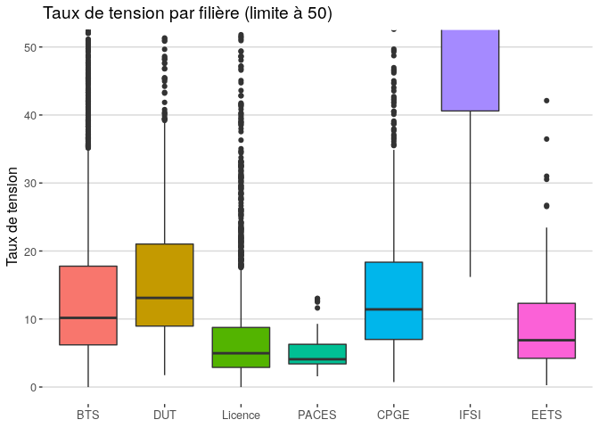<!-- -->

_Exemple de lecture : la médiane des taux de tension en BTS est de 10 ; la moitié des filières de BTS sont est entre 7 et 18 ; un quart est entre 18 et 35 ; les taux de tension hors normes en BTS montent jusqu'à presque 200._


<!-- -->


### Filières non sélectives (Licences) en tension

La Loi ORE dispose que : _"lorsque le nombre de candidatures excède les capacités d'accueil d'une formation, les inscriptions sont prononcées par le président ou le directeur de l'établissement dans la limite des capacités d'accueil"_.

La proportion de Licences dites "en tension" selon cette définition est :

<!-- -->

## Taux de remplissage

Le taux de remplissage est défini comme le rapport entre le nombre de cadnidats admis et les capacités d'accueil :

$remplissage=\frac{admis}{capacité}$


<!-- -->


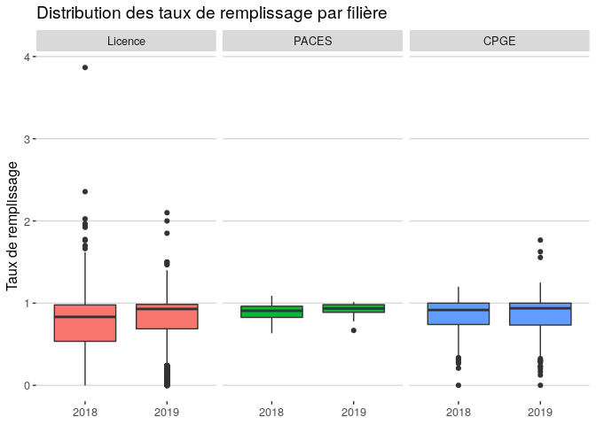<!-- -->

Une comparaison entre 2018 et 2019 montre une amélioration des taux de remplissage en Licence et PACES, mais quelques débordements nouveaux en CPGE.

<!-- -->


### Top 10

<table class="table" style="margin-left: auto; margin-right: auto;">
 <thead>
  <tr>
   <th style="text-align:left;"> Établissement </th>
   <th style="text-align:left;"> CP </th>
   <th style="text-align:left;"> Type </th>
   <th style="text-align:left;"> Filière </th>
   <th style="text-align:left;"> Détail </th>
   <th style="text-align:right;"> Capacité </th>
   <th style="text-align:right;"> Admis.phase.prin </th>
   <th style="text-align:right;"> Admis.phase.comp </th>
   <th style="text-align:left;"> Taux.de.remplissage </th>
  </tr>
 </thead>
<tbody>
  <tr>
   <td style="text-align:left;"> IRTESS </td>
   <td style="text-align:left;"> 21 </td>
   <td style="text-align:left;"> EETS </td>
   <td style="text-align:left;"> D.E Educateur Technique Spécialisé </td>
   <td style="text-align:left;">  </td>
   <td style="text-align:right;"> 3 </td>
   <td style="text-align:right;"> 9 </td>
   <td style="text-align:right;"> 0 </td>
   <td style="text-align:left;"> 300.00% </td>
  </tr>
  <tr>
   <td style="text-align:left;"> Université de Versailles - Saint Quentin en Yvelines </td>
   <td style="text-align:left;"> 78 </td>
   <td style="text-align:left;"> Licence </td>
   <td style="text-align:left;"> Droit </td>
   <td style="text-align:left;"> Droit International </td>
   <td style="text-align:right;"> 50 </td>
   <td style="text-align:right;"> 105 </td>
   <td style="text-align:right;"> 0 </td>
   <td style="text-align:left;"> 210.00% </td>
  </tr>
  <tr>
   <td style="text-align:left;"> Aix Marseille Université - site d'Aix-en-Provence </td>
   <td style="text-align:left;"> 13 </td>
   <td style="text-align:left;"> Licence </td>
   <td style="text-align:left;"> Langues étrangères appliquées </td>
   <td style="text-align:left;"> LEA Anglais-Coréen </td>
   <td style="text-align:right;"> 25 </td>
   <td style="text-align:right;"> 50 </td>
   <td style="text-align:right;"> 0 </td>
   <td style="text-align:left;"> 200.00% </td>
  </tr>
  <tr>
   <td style="text-align:left;"> Université Lumière-Lyon 2 </td>
   <td style="text-align:left;"> 69 </td>
   <td style="text-align:left;"> Licence </td>
   <td style="text-align:left;"> Langues étrangères appliquées </td>
   <td style="text-align:left;"> Langues: Anglais - Italien - Programme International MINERVE </td>
   <td style="text-align:right;"> 20 </td>
   <td style="text-align:right;"> 37 </td>
   <td style="text-align:right;"> 0 </td>
   <td style="text-align:left;"> 185.00% </td>
  </tr>
  <tr>
   <td style="text-align:left;"> Lycée Louise Michel </td>
   <td style="text-align:left;"> 38 </td>
   <td style="text-align:left;"> BTS </td>
   <td style="text-align:left;"> Gestion de la PME </td>
   <td style="text-align:left;">  </td>
   <td style="text-align:right;"> 32 </td>
   <td style="text-align:right;"> 58 </td>
   <td style="text-align:right;"> 0 </td>
   <td style="text-align:left;"> 184.38% </td>
  </tr>
  <tr>
   <td style="text-align:left;"> LPA de Rochefort-Montagne </td>
   <td style="text-align:left;"> 63 </td>
   <td style="text-align:left;"> BTS </td>
   <td style="text-align:left;"> Gestion et protection de la nature </td>
   <td style="text-align:left;">  </td>
   <td style="text-align:right;"> 26 </td>
   <td style="text-align:right;"> 47 </td>
   <td style="text-align:right;"> 0 </td>
   <td style="text-align:left;"> 180.77% </td>
  </tr>
  <tr>
   <td style="text-align:left;"> Lycée Irene et Frederic Joliot Curie </td>
   <td style="text-align:left;"> 34 </td>
   <td style="text-align:left;"> CPGE </td>
   <td style="text-align:left;"> TSI </td>
   <td style="text-align:left;">  </td>
   <td style="text-align:right;"> 30 </td>
   <td style="text-align:right;"> 53 </td>
   <td style="text-align:right;"> 0 </td>
   <td style="text-align:left;"> 176.67% </td>
  </tr>
  <tr>
   <td style="text-align:left;"> Lycée Emmanuel d'Alzon </td>
   <td style="text-align:left;"> 30 </td>
   <td style="text-align:left;"> CPGE </td>
   <td style="text-align:left;"> MPSI </td>
   <td style="text-align:left;">  </td>
   <td style="text-align:right;"> 48 </td>
   <td style="text-align:right;"> 78 </td>
   <td style="text-align:right;"> 0 </td>
   <td style="text-align:left;"> 162.50% </td>
  </tr>
  <tr>
   <td style="text-align:left;"> IFSI Emile Roux (AP-HP) </td>
   <td style="text-align:left;"> 94 </td>
   <td style="text-align:left;"> IFSI </td>
   <td style="text-align:left;"> D.E Infirmier </td>
   <td style="text-align:left;"> IFSI Emile Roux (AP-HP) - rentrée en février </td>
   <td style="text-align:right;"> 69 </td>
   <td style="text-align:right;"> 112 </td>
   <td style="text-align:right;"> 0 </td>
   <td style="text-align:left;"> 162.32% </td>
  </tr>
  <tr>
   <td style="text-align:left;"> IFSI CH Cayenne </td>
   <td style="text-align:left;"> 973 </td>
   <td style="text-align:left;"> IFSI </td>
   <td style="text-align:left;"> D.E Infirmier </td>
   <td style="text-align:left;"> IFSI CH Cayenne - rentrée en septembre </td>
   <td style="text-align:right;"> 54 </td>
   <td style="text-align:right;"> 84 </td>
   <td style="text-align:right;"> 0 </td>
   <td style="text-align:left;"> 155.56% </td>
  </tr>
</tbody>
</table>

### Bottom 10

<table class="table" style="margin-left: auto; margin-right: auto;">
 <thead>
  <tr>
   <th style="text-align:left;"> Établissement </th>
   <th style="text-align:left;"> CP </th>
   <th style="text-align:left;"> Type </th>
   <th style="text-align:left;"> Filière </th>
   <th style="text-align:left;"> Détail </th>
   <th style="text-align:right;"> Capacité </th>
   <th style="text-align:right;"> Admis.phase.prin </th>
   <th style="text-align:right;"> Admis.phase.comp </th>
   <th style="text-align:left;"> Taux.de.remplissage </th>
  </tr>
 </thead>
<tbody>
  <tr>
   <td style="text-align:left;"> Institut Catholique de Toulouse </td>
   <td style="text-align:left;"> 31 </td>
   <td style="text-align:left;"> Licence </td>
   <td style="text-align:left;"> Langues étrangères appliquées </td>
   <td style="text-align:left;"> Langues Etrangères Appliquées anglais et allemand </td>
   <td style="text-align:right;"> 120 </td>
   <td style="text-align:right;"> 0 </td>
   <td style="text-align:right;"> 0 </td>
   <td style="text-align:left;"> 0% </td>
  </tr>
  <tr>
   <td style="text-align:left;"> INALCO </td>
   <td style="text-align:left;"> 75 </td>
   <td style="text-align:left;"> Licence </td>
   <td style="text-align:left;"> Langues, littératures &amp; civilisations étrangères et régionales </td>
   <td style="text-align:left;"> Langues, Littératures et Civilisations, parcours Europe et Eurasie - Slovène </td>
   <td style="text-align:right;"> 55 </td>
   <td style="text-align:right;"> 0 </td>
   <td style="text-align:right;"> 0 </td>
   <td style="text-align:left;"> 0% </td>
  </tr>
  <tr>
   <td style="text-align:left;"> INALCO </td>
   <td style="text-align:left;"> 75 </td>
   <td style="text-align:left;"> Licence </td>
   <td style="text-align:left;"> Langues, littératures &amp; civilisations étrangères et régionales </td>
   <td style="text-align:left;"> Langues, Littératures et Civilisations,  parcours Asie et Pacifique -  Rromani </td>
   <td style="text-align:right;"> 55 </td>
   <td style="text-align:right;"> 0 </td>
   <td style="text-align:right;"> 0 </td>
   <td style="text-align:left;"> 0% </td>
  </tr>
  <tr>
   <td style="text-align:left;"> INALCO </td>
   <td style="text-align:left;"> 75 </td>
   <td style="text-align:left;"> Licence </td>
   <td style="text-align:left;"> Langues, littératures &amp; civilisations étrangères et régionales </td>
   <td style="text-align:left;"> Langues, Littératures et Civilisations, parcours Europe et Eurasie - Macédonien </td>
   <td style="text-align:right;"> 55 </td>
   <td style="text-align:right;"> 0 </td>
   <td style="text-align:right;"> 0 </td>
   <td style="text-align:left;"> 0% </td>
  </tr>
  <tr>
   <td style="text-align:left;"> Université Paul Valery - Montpellier 3 </td>
   <td style="text-align:left;"> 34 </td>
   <td style="text-align:left;"> Licence </td>
   <td style="text-align:left;"> Langues, littératures &amp; civilisations étrangères et régionales </td>
   <td style="text-align:left;"> LLCER Parcours Grec moderne </td>
   <td style="text-align:right;"> 45 </td>
   <td style="text-align:right;"> 0 </td>
   <td style="text-align:right;"> 0 </td>
   <td style="text-align:left;"> 0% </td>
  </tr>
  <tr>
   <td style="text-align:left;"> Lycée Saint Leon </td>
   <td style="text-align:left;"> 91 </td>
   <td style="text-align:left;"> CPGE </td>
   <td style="text-align:left;"> PTSI </td>
   <td style="text-align:left;">  </td>
   <td style="text-align:right;"> 45 </td>
   <td style="text-align:right;"> 0 </td>
   <td style="text-align:right;"> 0 </td>
   <td style="text-align:left;"> 0% </td>
  </tr>
  <tr>
   <td style="text-align:left;"> Université Jean Moulin Lyon 3 </td>
   <td style="text-align:left;"> 69 </td>
   <td style="text-align:left;"> Licence </td>
   <td style="text-align:left;"> Lettres </td>
   <td style="text-align:left;"> Double licence : Lettres et Philosophie </td>
   <td style="text-align:right;"> 42 </td>
   <td style="text-align:right;"> 0 </td>
   <td style="text-align:right;"> 0 </td>
   <td style="text-align:left;"> 0% </td>
  </tr>
  <tr>
   <td style="text-align:left;"> Institut Catholique de Rennes </td>
   <td style="text-align:left;"> 35 </td>
   <td style="text-align:left;"> Licence </td>
   <td style="text-align:left;"> Lettres </td>
   <td style="text-align:left;"> Lettres Modernes parcours Orthophonie </td>
   <td style="text-align:right;"> 40 </td>
   <td style="text-align:right;"> 0 </td>
   <td style="text-align:right;"> 0 </td>
   <td style="text-align:left;"> 0% </td>
  </tr>
  <tr>
   <td style="text-align:left;"> Université de Lille </td>
   <td style="text-align:left;"> 59 </td>
   <td style="text-align:left;"> Licence </td>
   <td style="text-align:left;"> Langues, littératures &amp; civilisations étrangères et régionales </td>
   <td style="text-align:left;"> Polonais </td>
   <td style="text-align:right;"> 40 </td>
   <td style="text-align:right;"> 0 </td>
   <td style="text-align:right;"> 0 </td>
   <td style="text-align:left;"> 0% </td>
  </tr>
  <tr>
   <td style="text-align:left;"> OMNIS - Ecole supérieure de commerce &amp; management </td>
   <td style="text-align:left;"> 67 </td>
   <td style="text-align:left;"> BTS </td>
   <td style="text-align:left;"> Support à l'action managériale </td>
   <td style="text-align:left;">  </td>
   <td style="text-align:right;"> 35 </td>
   <td style="text-align:right;"> 0 </td>
   <td style="text-align:right;"> 0 </td>
   <td style="text-align:left;"> 0% </td>
  </tr>
</tbody>
</table>

### Par secteur discplinaire

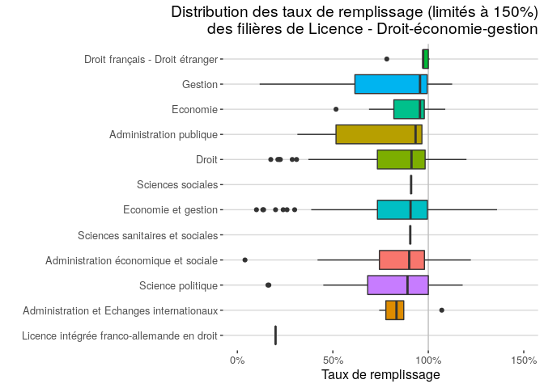<!-- -->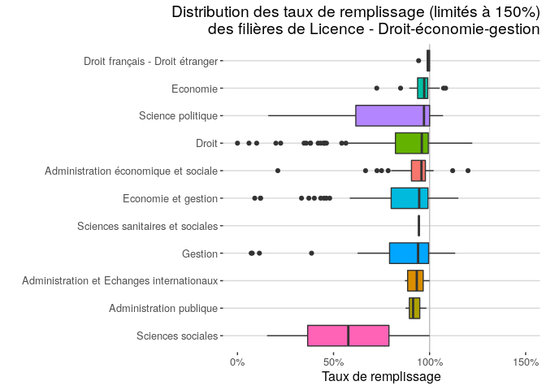<!-- -->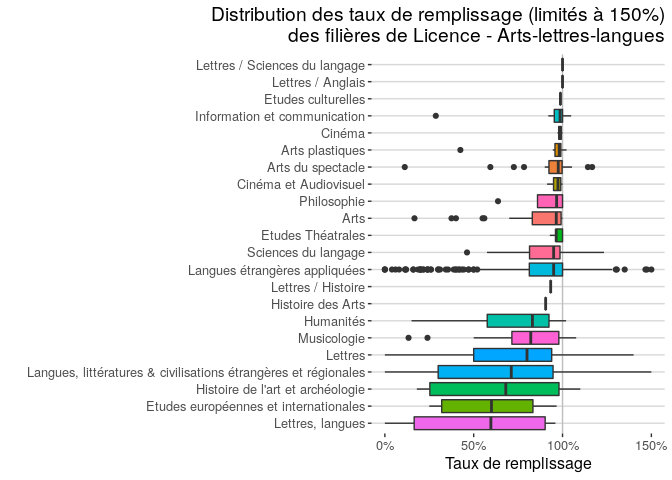<!-- -->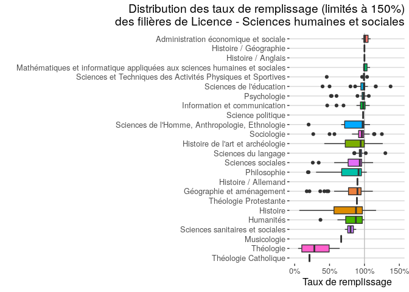<!-- -->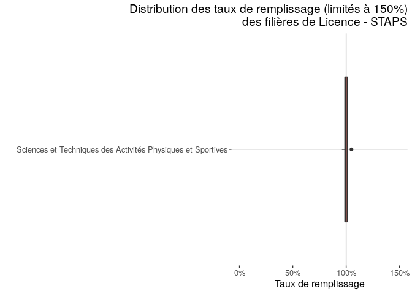<!-- -->

<!-- #### Licence - Arts-lettres-langues / Allemand -->

<!-- Certaines filières peinent à recruter. C'est le cas notamment des [LLCE Allemand](https://www.lemonde.fr/campus/article/2019/11/10/facs-d-allemand-cherchent-etudiants-desesperement_6018657_4401467.html). -->

<!-- L'étude par filière de formation très détaillée n'est pas possible du fait du trop grand nombre de mentions différentes. On peut cependant détecter la présence de mots dans l'intitulé. -->

<!-- ```{r Taux.de.remplissage.ALL.allemandounon, echo=FALSE} -->

<!-- ps %>% -->
<!--   filter(Filière.de.formation.détaillée == "Langues, littératures & civilisations étrangères et régionales") %>% -->
<!--   mutate(Allemand=ifelse(grepl("allemand",tolower(Filière.de.formation.très.détaillée)),"Oui","Non")) %>% -->
<!-- ggplot(aes(x=Taux.de.remplissage, -->
<!--            fill=Allemand)) +  -->
<!--   geom_histogram(bins = 10,color="white") + -->
<!--   xlab("Taux de remplissage") + -->
<!--   ylab("Nombre de formations") + -->
<!--   #scale_y_log10() + -->
<!--   scale_x_continuous(labels=scales::percent) + -->
<!--   theme_hc() + -->
<!--   #guides(fill=FALSE) + -->
<!--   ggtitle("Distribution des taux de remplissage des filières de Licence LLCER\nayant 'Allemand' ou non dans l'intitulé") + -->
<!--   theme(plot.title = element_text(hjust = 1)) -->
<!-- ``` -->


## Taux de sélection

Le taux de sélection est défini comme le rapport entre le nombre d'appelés (admis ou non, grâce au rang du dernier appelé), et le nombre de candidats en phase principale :

<!-- $sélection=\frac{rang.du.dernier.appelé}{candidats}$ -->
sélection = rang du dernier appelé / candidats

_Interprétation : un taux de sélection de 100% signifie que tous les candidats ont été appelés. Plus le taux est bas, plus la formation est sélective._

_Attention_ : Théoriquement, une formation est considérée comme "Non-sélective" si et seulement si elle présente un taux de sélection de 100%. Cependant, les données présentent plusieurs défauts qui empêchent ce calcul :

- des Licences manifestement non-sélectives présentent un nombre de candidats classés légèrement inférieur au nombre de candidats (parfois de 1 ou 2 sur des milliers), qui ne peut être assimilé à de la sélection ;
- utiliser l'existence d'appels en phase complémentaire pour détecter les filières non-sélectives n'est pas possible puisque des places ont été ajoutées en cours de procédure ;
- le rang du dernier appelé n'est pas disponible pour plusieurs formations, particulièrement en BTS et DUT :

<table class="table" style="margin-left: auto; margin-right: auto;">
 <thead>
  <tr>
   <th style="text-align:left;"> Filière.de.formation.très.agrégée </th>
   <th style="text-align:left;"> Rang.du.dernier.appelé.disponible </th>
  </tr>
 </thead>
<tbody>
  <tr>
   <td style="text-align:left;"> BTS </td>
   <td style="text-align:left;"> 8% </td>
  </tr>
  <tr>
   <td style="text-align:left;"> DUT </td>
   <td style="text-align:left;"> 1% </td>
  </tr>
  <tr>
   <td style="text-align:left;"> Licence </td>
   <td style="text-align:left;"> 89% </td>
  </tr>
  <tr>
   <td style="text-align:left;"> PACES </td>
   <td style="text-align:left;"> 79% </td>
  </tr>
  <tr>
   <td style="text-align:left;"> CPGE </td>
   <td style="text-align:left;"> 92% </td>
  </tr>
  <tr>
   <td style="text-align:left;"> IFSI </td>
   <td style="text-align:left;"> 75% </td>
  </tr>
  <tr>
   <td style="text-align:left;"> EETS </td>
   <td style="text-align:left;"> 90% </td>
  </tr>
</tbody>
</table>

C'est pourquoi, est considérée comme :

- "Non-sélective" : les formation dont le taux de sélection est supérieur ou égal à 95%. Pour des questions de lisibilité, leur taux de sélection est forcé à 100% ;
- "Sélective" : les formation dont le taux de sélection est inférieur à 95% ;
- "Hyper-Sélective" : les formation dont le taux de sélection est inférieur à 20%.

_NB_ : 

- Avec cette interprétation, il est possible que des formations ayant éliminé quelques candidats soient considérées comme non-sélectives.
- Les statistiques sur les formations et les établissements se basent sur les données disponibles, celles sur les candidats considèrent BTS, CPGE et DUT comme sélectives, et Licence et PACES comme non sélectives.


```
## Warning: Removed 468 rows containing non-finite values (stat_boxplot).
```

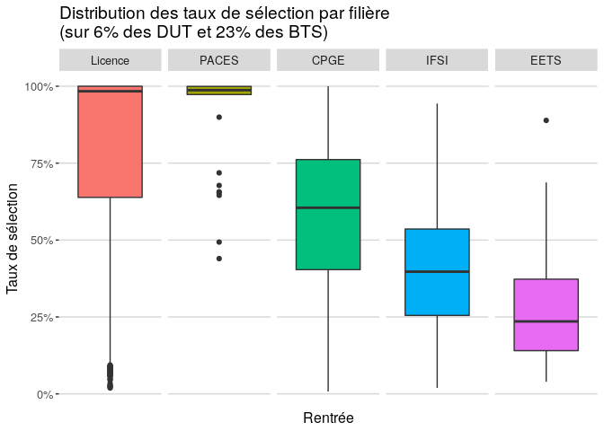<!-- -->


```
## Warning: Removed 413 rows containing non-finite values (stat_boxplot).
```

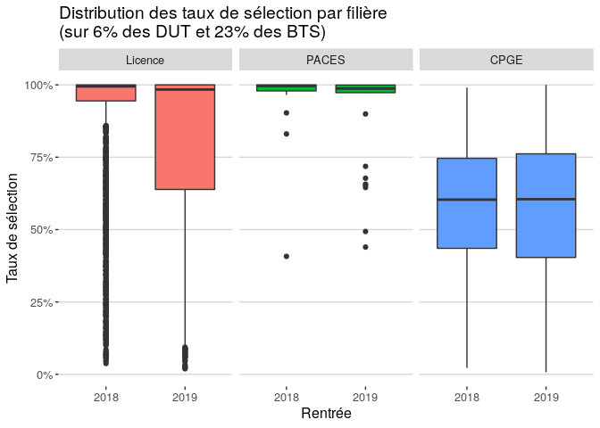<!-- -->

Entre 2018 et 2019, on constate un sensible augmentation des taux de sélection en Licence.

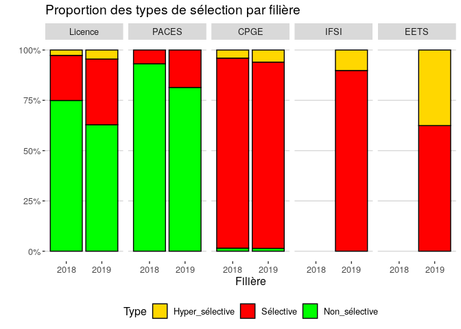<!-- -->

D'abord, il faut remarquer que les IFSI et EETS sont des filières remarquablement hyper-sélectives, et ensuite que les taux de sélection augmentent dans toutes les flilières.

Ensuite, on constate que des CPGE, même en très faible nombre, sont également non sélectives. D'un autre côté, un tiers des Licences sont sélectives, voire hyper-sélectives. Cela démontre que l'appelation administrative « filière non sélective » n'a plus lieu d'être.


### Top 10

<table class="table" style="margin-left: auto; margin-right: auto;">
 <thead>
  <tr>
   <th style="text-align:left;"> Établissement </th>
   <th style="text-align:left;"> CP </th>
   <th style="text-align:left;"> Type </th>
   <th style="text-align:left;"> Filière </th>
   <th style="text-align:right;"> Capacité </th>
   <th style="text-align:right;"> Candidats </th>
   <th style="text-align:right;"> Rang.du.dernier.appelé </th>
   <th style="text-align:left;"> Taux.de.sélection </th>
  </tr>
 </thead>
<tbody>
  <tr>
   <td style="text-align:left;"> Lycée Henri IV </td>
   <td style="text-align:left;"> 75 </td>
   <td style="text-align:left;"> CPGE </td>
   <td style="text-align:left;"> Option économique - Prépa St Cyr </td>
   <td style="text-align:right;"> 2 </td>
   <td style="text-align:right;"> 262 </td>
   <td style="text-align:right;"> 2 </td>
   <td style="text-align:left;"> 0.763% </td>
  </tr>
  <tr>
   <td style="text-align:left;"> Université de Lille </td>
   <td style="text-align:left;"> 59 </td>
   <td style="text-align:left;"> Licence </td>
   <td style="text-align:left;"> Gestion </td>
   <td style="text-align:right;"> 15 </td>
   <td style="text-align:right;"> 730 </td>
   <td style="text-align:right;"> 14 </td>
   <td style="text-align:left;"> 1.918% </td>
  </tr>
  <tr>
   <td style="text-align:left;"> IFSI CRIP - Réservé aux personnes en situation de handicap </td>
   <td style="text-align:left;"> 34 </td>
   <td style="text-align:left;"> IFSI </td>
   <td style="text-align:left;"> D.E Infirmier </td>
   <td style="text-align:right;"> 10 </td>
   <td style="text-align:right;"> 930 </td>
   <td style="text-align:right;"> 18 </td>
   <td style="text-align:left;"> 1.935% </td>
  </tr>
  <tr>
   <td style="text-align:left;"> Université Paris 1 Panthéon Sorbonne </td>
   <td style="text-align:left;"> 75 </td>
   <td style="text-align:left;"> Licence </td>
   <td style="text-align:left;"> Droit </td>
   <td style="text-align:right;"> 15 </td>
   <td style="text-align:right;"> 1313 </td>
   <td style="text-align:right;"> 29 </td>
   <td style="text-align:left;"> 2.209% </td>
  </tr>
  <tr>
   <td style="text-align:left;"> Université Paris 2 Panthéon - Assas </td>
   <td style="text-align:left;"> 75 </td>
   <td style="text-align:left;"> Licence </td>
   <td style="text-align:left;"> Droit </td>
   <td style="text-align:right;"> 35 </td>
   <td style="text-align:right;"> 4464 </td>
   <td style="text-align:right;"> 107 </td>
   <td style="text-align:left;"> 2.397% </td>
  </tr>
  <tr>
   <td style="text-align:left;"> Université Paris Descartes Paris 5 </td>
   <td style="text-align:left;"> 75 </td>
   <td style="text-align:left;"> Licence </td>
   <td style="text-align:left;"> Sciences pour la santé </td>
   <td style="text-align:right;"> 6 </td>
   <td style="text-align:right;"> 2231 </td>
   <td style="text-align:right;"> 61 </td>
   <td style="text-align:left;"> 2.734% </td>
  </tr>
  <tr>
   <td style="text-align:left;"> Université de Bordeaux - Bordeaux Métropole </td>
   <td style="text-align:left;"> 33 </td>
   <td style="text-align:left;"> Licence </td>
   <td style="text-align:left;"> Droit </td>
   <td style="text-align:right;"> 30 </td>
   <td style="text-align:right;"> 1901 </td>
   <td style="text-align:right;"> 53 </td>
   <td style="text-align:left;"> 2.788% </td>
  </tr>
  <tr>
   <td style="text-align:left;"> Lycée Vauban </td>
   <td style="text-align:left;"> 29 </td>
   <td style="text-align:left;"> BTS </td>
   <td style="text-align:left;"> Systèmes numériques - Option électronique et communication </td>
   <td style="text-align:right;"> 1 </td>
   <td style="text-align:right;"> 32 </td>
   <td style="text-align:right;"> 1 </td>
   <td style="text-align:left;"> 3.125% </td>
  </tr>
  <tr>
   <td style="text-align:left;"> Lycée Vauban </td>
   <td style="text-align:left;"> 29 </td>
   <td style="text-align:left;"> BTS </td>
   <td style="text-align:left;"> Systèmes numériques - Option informatique et réseaux </td>
   <td style="text-align:right;"> 1 </td>
   <td style="text-align:right;"> 60 </td>
   <td style="text-align:right;"> 2 </td>
   <td style="text-align:left;"> 3.333% </td>
  </tr>
  <tr>
   <td style="text-align:left;"> Université de Lille </td>
   <td style="text-align:left;"> 59 </td>
   <td style="text-align:left;"> Licence </td>
   <td style="text-align:left;"> Economie et gestion </td>
   <td style="text-align:right;"> 25 </td>
   <td style="text-align:right;"> 827 </td>
   <td style="text-align:right;"> 28 </td>
   <td style="text-align:left;"> 3.386% </td>
  </tr>
</tbody>
</table>

### Bottom 10

<table class="table" style="margin-left: auto; margin-right: auto;">
 <thead>
  <tr>
   <th style="text-align:left;"> Établissement </th>
   <th style="text-align:left;"> CP </th>
   <th style="text-align:left;"> Type </th>
   <th style="text-align:left;"> Filière </th>
   <th style="text-align:right;"> Capacité </th>
   <th style="text-align:right;"> Candidats </th>
   <th style="text-align:right;"> Rang.du.dernier.appelé </th>
   <th style="text-align:left;"> Taux.de.sélection </th>
  </tr>
 </thead>
<tbody>
  <tr>
   <td style="text-align:left;"> Université de Versailles - Saint Quentin en Yvelines </td>
   <td style="text-align:left;"> 78 </td>
   <td style="text-align:left;"> PACES </td>
   <td style="text-align:left;"> PACES - Médecine, Pharmacie, Odontologie (dentiste), Maïeutique (sage-femmes) </td>
   <td style="text-align:right;"> 950 </td>
   <td style="text-align:right;"> 8099 </td>
   <td style="text-align:right;"> 8099 </td>
   <td style="text-align:left;"> 100% </td>
  </tr>
  <tr>
   <td style="text-align:left;"> Université de Lille </td>
   <td style="text-align:left;"> 59 </td>
   <td style="text-align:left;"> Licence </td>
   <td style="text-align:left;"> Economie et gestion </td>
   <td style="text-align:right;"> 570 </td>
   <td style="text-align:right;"> 3838 </td>
   <td style="text-align:right;"> 3838 </td>
   <td style="text-align:left;"> 100% </td>
  </tr>
  <tr>
   <td style="text-align:left;"> Université de Lille </td>
   <td style="text-align:left;"> 59 </td>
   <td style="text-align:left;"> Licence </td>
   <td style="text-align:left;"> Droit </td>
   <td style="text-align:right;"> 910 </td>
   <td style="text-align:right;"> 3321 </td>
   <td style="text-align:right;"> 3321 </td>
   <td style="text-align:left;"> 100% </td>
  </tr>
  <tr>
   <td style="text-align:left;"> Université Clermont Auvergne </td>
   <td style="text-align:left;"> 63 </td>
   <td style="text-align:left;"> Licence </td>
   <td style="text-align:left;"> Droit </td>
   <td style="text-align:right;"> 660 </td>
   <td style="text-align:right;"> 2710 </td>
   <td style="text-align:right;"> 2710 </td>
   <td style="text-align:left;"> 100% </td>
  </tr>
  <tr>
   <td style="text-align:left;"> Université de Nantes </td>
   <td style="text-align:left;"> 44 </td>
   <td style="text-align:left;"> Licence </td>
   <td style="text-align:left;"> Sociologie </td>
   <td style="text-align:right;"> 410 </td>
   <td style="text-align:right;"> 2201 </td>
   <td style="text-align:right;"> 2201 </td>
   <td style="text-align:left;"> 100% </td>
  </tr>
  <tr>
   <td style="text-align:left;"> Université de Lille </td>
   <td style="text-align:left;"> 59 </td>
   <td style="text-align:left;"> Licence </td>
   <td style="text-align:left;"> Langues étrangères appliquées </td>
   <td style="text-align:right;"> 360 </td>
   <td style="text-align:right;"> 1990 </td>
   <td style="text-align:right;"> 1990 </td>
   <td style="text-align:left;"> 100% </td>
  </tr>
  <tr>
   <td style="text-align:left;"> Université de Rouen Normandie - Campus Mont-Saint-Aignan </td>
   <td style="text-align:left;"> 76 </td>
   <td style="text-align:left;"> Licence </td>
   <td style="text-align:left;"> Sciences de la vie et de la terre </td>
   <td style="text-align:right;"> 410 </td>
   <td style="text-align:right;"> 1828 </td>
   <td style="text-align:right;"> 1828 </td>
   <td style="text-align:left;"> 100% </td>
  </tr>
  <tr>
   <td style="text-align:left;"> Université de la Réunion - Le Tampon </td>
   <td style="text-align:left;"> 974 </td>
   <td style="text-align:left;"> Licence </td>
   <td style="text-align:left;"> Sciences et Techniques des Activités Physiques et Sportives </td>
   <td style="text-align:right;"> 650 </td>
   <td style="text-align:right;"> 1772 </td>
   <td style="text-align:right;"> 1772 </td>
   <td style="text-align:left;"> 100% </td>
  </tr>
  <tr>
   <td style="text-align:left;"> Université de Toulon </td>
   <td style="text-align:left;"> 83 </td>
   <td style="text-align:left;"> Licence </td>
   <td style="text-align:left;"> Droit </td>
   <td style="text-align:right;"> 460 </td>
   <td style="text-align:right;"> 1731 </td>
   <td style="text-align:right;"> 1731 </td>
   <td style="text-align:left;"> 100% </td>
  </tr>
  <tr>
   <td style="text-align:left;"> Université de Nantes </td>
   <td style="text-align:left;"> 44 </td>
   <td style="text-align:left;"> Licence </td>
   <td style="text-align:left;"> Langues, littératures &amp; civilisations étrangères et régionales </td>
   <td style="text-align:right;"> 410 </td>
   <td style="text-align:right;"> 1518 </td>
   <td style="text-align:right;"> 1518 </td>
   <td style="text-align:left;"> 100% </td>
  </tr>
</tbody>
</table>

### Filières non-sélectives (Licences)


<!-- -->


```
## Picking joint bandwidth of 15.1
```

```
## Warning: Removed 94 rows containing non-finite values (stat_density_ridges).
```

<!-- -->

Ce graphique permet de confirmer que les Licences hyper-sélectives concernent généralement de petits groupes, alors que les filières non-sélectives ont tout type de taille de groupe.

<table class="table" style="margin-left: auto; margin-right: auto;">
 <thead>
  <tr>
   <th style="text-align:left;"> Établissement </th>
   <th style="text-align:left;"> CP </th>
   <th style="text-align:left;"> Type </th>
   <th style="text-align:left;"> Filière </th>
   <th style="text-align:right;"> Capacité </th>
   <th style="text-align:right;"> Candidats </th>
   <th style="text-align:right;"> Rang.du.dernier.appelé </th>
   <th style="text-align:left;"> Taux.de.sélection </th>
  </tr>
 </thead>
<tbody>
  <tr>
   <td style="text-align:left;"> Université de Lille </td>
   <td style="text-align:left;"> 59 </td>
   <td style="text-align:left;"> Licence </td>
   <td style="text-align:left;"> Gestion </td>
   <td style="text-align:right;"> 15 </td>
   <td style="text-align:right;"> 730 </td>
   <td style="text-align:right;"> 14 </td>
   <td style="text-align:left;"> 1.918% </td>
  </tr>
  <tr>
   <td style="text-align:left;"> Université Paris 1 Panthéon Sorbonne </td>
   <td style="text-align:left;"> 75 </td>
   <td style="text-align:left;"> Licence </td>
   <td style="text-align:left;"> Droit </td>
   <td style="text-align:right;"> 15 </td>
   <td style="text-align:right;"> 1313 </td>
   <td style="text-align:right;"> 29 </td>
   <td style="text-align:left;"> 2.209% </td>
  </tr>
  <tr>
   <td style="text-align:left;"> Université Paris 2 Panthéon - Assas </td>
   <td style="text-align:left;"> 75 </td>
   <td style="text-align:left;"> Licence </td>
   <td style="text-align:left;"> Droit </td>
   <td style="text-align:right;"> 35 </td>
   <td style="text-align:right;"> 4464 </td>
   <td style="text-align:right;"> 107 </td>
   <td style="text-align:left;"> 2.397% </td>
  </tr>
  <tr>
   <td style="text-align:left;"> Université Paris Descartes Paris 5 </td>
   <td style="text-align:left;"> 75 </td>
   <td style="text-align:left;"> Licence </td>
   <td style="text-align:left;"> Sciences pour la santé </td>
   <td style="text-align:right;"> 6 </td>
   <td style="text-align:right;"> 2231 </td>
   <td style="text-align:right;"> 61 </td>
   <td style="text-align:left;"> 2.734% </td>
  </tr>
  <tr>
   <td style="text-align:left;"> Université de Bordeaux - Bordeaux Métropole </td>
   <td style="text-align:left;"> 33 </td>
   <td style="text-align:left;"> Licence </td>
   <td style="text-align:left;"> Droit </td>
   <td style="text-align:right;"> 30 </td>
   <td style="text-align:right;"> 1901 </td>
   <td style="text-align:right;"> 53 </td>
   <td style="text-align:left;"> 2.788% </td>
  </tr>
  <tr>
   <td style="text-align:left;"> Université de Lille </td>
   <td style="text-align:left;"> 59 </td>
   <td style="text-align:left;"> Licence </td>
   <td style="text-align:left;"> Economie et gestion </td>
   <td style="text-align:right;"> 25 </td>
   <td style="text-align:right;"> 827 </td>
   <td style="text-align:right;"> 28 </td>
   <td style="text-align:left;"> 3.386% </td>
  </tr>
  <tr>
   <td style="text-align:left;"> Université Paris 1 Panthéon Sorbonne </td>
   <td style="text-align:left;"> 75 </td>
   <td style="text-align:left;"> Licence </td>
   <td style="text-align:left;"> Droit </td>
   <td style="text-align:right;"> 50 </td>
   <td style="text-align:right;"> 2872 </td>
   <td style="text-align:right;"> 128 </td>
   <td style="text-align:left;"> 4.457% </td>
  </tr>
  <tr>
   <td style="text-align:left;"> IPC-Facultés Libres de Philosophie et de Psycholog </td>
   <td style="text-align:left;"> 75 </td>
   <td style="text-align:left;"> Licence </td>
   <td style="text-align:left;"> Psychologie </td>
   <td style="text-align:right;"> 20 </td>
   <td style="text-align:right;"> 663 </td>
   <td style="text-align:right;"> 32 </td>
   <td style="text-align:left;"> 4.827% </td>
  </tr>
  <tr>
   <td style="text-align:left;"> Université Paris 1 Panthéon Sorbonne </td>
   <td style="text-align:left;"> 75 </td>
   <td style="text-align:left;"> Licence </td>
   <td style="text-align:left;"> Science politique </td>
   <td style="text-align:right;"> 65 </td>
   <td style="text-align:right;"> 5351 </td>
   <td style="text-align:right;"> 269 </td>
   <td style="text-align:left;"> 5.027% </td>
  </tr>
  <tr>
   <td style="text-align:left;"> Université de Rennes 1 </td>
   <td style="text-align:left;"> 35 </td>
   <td style="text-align:left;"> Licence </td>
   <td style="text-align:left;"> Droit </td>
   <td style="text-align:right;"> 20 </td>
   <td style="text-align:right;"> 857 </td>
   <td style="text-align:right;"> 50 </td>
   <td style="text-align:left;"> 5.834% </td>
  </tr>
</tbody>
</table>


### Par établissements

Le taux de Licences sélective est défini comme le rapport entre le nombre de Licences sélectives, et le nombre total de Licences.

_Attention_ : Dans le jeu de données, les établissements de grande taille sont éclatés par site.


  

<!-- -->

### Top 10  

TSM : Taux de Sélection Moyen des Licences sélectives

<table class="table" style="margin-left: auto; margin-right: auto;">
 <thead>
  <tr>
   <th style="text-align:left;"> Établissement </th>
   <th style="text-align:right;"> Nb.L </th>
   <th style="text-align:right;"> Nb_Sélective </th>
   <th style="text-align:left;"> Taux_Sélective </th>
   <th style="text-align:left;"> TSM_Sélective </th>
  </tr>
 </thead>
<tbody>
  <tr>
   <td style="text-align:left;"> Université Paris-Sud, campus de Sceaux </td>
   <td style="text-align:right;"> 6 </td>
   <td style="text-align:right;"> 6 </td>
   <td style="text-align:left;"> 100% </td>
   <td style="text-align:left;"> 60% </td>
  </tr>
  <tr>
   <td style="text-align:left;"> Institut Catholique de Lille-Faculté de Gestion, Economie et Sciences </td>
   <td style="text-align:right;"> 6 </td>
   <td style="text-align:right;"> 6 </td>
   <td style="text-align:left;"> 100% </td>
   <td style="text-align:left;"> 73% </td>
  </tr>
  <tr>
   <td style="text-align:left;"> Université Paris 2 Panthéon - Assas </td>
   <td style="text-align:right;"> 5 </td>
   <td style="text-align:right;"> 5 </td>
   <td style="text-align:left;"> 100% </td>
   <td style="text-align:left;"> 16% </td>
  </tr>
  <tr>
   <td style="text-align:left;"> Institut Supérieur de l'Enseignement Privé de Polynésie </td>
   <td style="text-align:right;"> 4 </td>
   <td style="text-align:right;"> 4 </td>
   <td style="text-align:left;"> 100% </td>
   <td style="text-align:left;"> 36% </td>
  </tr>
  <tr>
   <td style="text-align:left;"> CNAM de Franche-Comté site de Besançon et CNAM de Franche-Comté site de Belfort </td>
   <td style="text-align:right;"> 3 </td>
   <td style="text-align:right;"> 3 </td>
   <td style="text-align:left;"> 100% </td>
   <td style="text-align:left;"> 8% </td>
  </tr>
  <tr>
   <td style="text-align:left;"> Université Paris- Est- Créteil Val de Marne UPEC - Antenne de Sénart </td>
   <td style="text-align:right;"> 3 </td>
   <td style="text-align:right;"> 3 </td>
   <td style="text-align:left;"> 100% </td>
   <td style="text-align:left;"> 43% </td>
  </tr>
  <tr>
   <td style="text-align:left;"> Université d'Artois - Site de Liévin </td>
   <td style="text-align:right;"> 3 </td>
   <td style="text-align:right;"> 3 </td>
   <td style="text-align:left;"> 100% </td>
   <td style="text-align:left;"> 46% </td>
  </tr>
  <tr>
   <td style="text-align:left;"> Université Paris 13 - Antenne de Bobigny </td>
   <td style="text-align:right;"> 3 </td>
   <td style="text-align:right;"> 3 </td>
   <td style="text-align:left;"> 100% </td>
   <td style="text-align:left;"> 57% </td>
  </tr>
  <tr>
   <td style="text-align:left;"> Université Panthéon- Assas Paris2 - Antenne Melun </td>
   <td style="text-align:right;"> 3 </td>
   <td style="text-align:right;"> 3 </td>
   <td style="text-align:left;"> 100% </td>
   <td style="text-align:left;"> 70% </td>
  </tr>
  <tr>
   <td style="text-align:left;"> Université de Mulhouse - Site de Colmar - Faculté de marketing et d'agrosciences </td>
   <td style="text-align:right;"> 2 </td>
   <td style="text-align:right;"> 2 </td>
   <td style="text-align:left;"> 100% </td>
   <td style="text-align:left;"> 17% </td>
  </tr>
</tbody>
</table>


<table class="table" style="margin-left: auto; margin-right: auto;">
 <thead>
  <tr>
   <th style="text-align:left;"> Établissement </th>
   <th style="text-align:right;"> Nb.L </th>
   <th style="text-align:right;"> Nb_Sélective </th>
   <th style="text-align:left;"> Taux_Sélective </th>
   <th style="text-align:left;"> TSM_Sélective </th>
  </tr>
 </thead>
<tbody>
  <tr>
   <td style="text-align:left;"> Université Sorbonne Nouvelle Paris 3 </td>
   <td style="text-align:right;"> 83 </td>
   <td style="text-align:right;"> 53 </td>
   <td style="text-align:left;"> 64% </td>
   <td style="text-align:left;"> 58% </td>
  </tr>
  <tr>
   <td style="text-align:left;"> Université Jean Moulin Lyon 3 </td>
   <td style="text-align:right;"> 60 </td>
   <td style="text-align:right;"> 45 </td>
   <td style="text-align:left;"> 75% </td>
   <td style="text-align:left;"> 43% </td>
  </tr>
  <tr>
   <td style="text-align:left;"> Université Paris Nanterre </td>
   <td style="text-align:right;"> 72 </td>
   <td style="text-align:right;"> 37 </td>
   <td style="text-align:left;"> 51% </td>
   <td style="text-align:left;"> 58% </td>
  </tr>
  <tr>
   <td style="text-align:left;"> Université Paris 1 Panthéon Sorbonne </td>
   <td style="text-align:right;"> 41 </td>
   <td style="text-align:right;"> 35 </td>
   <td style="text-align:left;"> 85% </td>
   <td style="text-align:left;"> 27% </td>
  </tr>
  <tr>
   <td style="text-align:left;"> Université Paris- Est-Créteil Val de Marne - UPEC (Paris 12) </td>
   <td style="text-align:right;"> 42 </td>
   <td style="text-align:right;"> 33 </td>
   <td style="text-align:left;"> 79% </td>
   <td style="text-align:left;"> 48% </td>
  </tr>
  <tr>
   <td style="text-align:left;"> Université de Lille </td>
   <td style="text-align:right;"> 87 </td>
   <td style="text-align:right;"> 33 </td>
   <td style="text-align:left;"> 38% </td>
   <td style="text-align:left;"> 48% </td>
  </tr>
  <tr>
   <td style="text-align:left;"> Université Paris Diderot - Paris 7 </td>
   <td style="text-align:right;"> 40 </td>
   <td style="text-align:right;"> 32 </td>
   <td style="text-align:left;"> 80% </td>
   <td style="text-align:left;"> 38% </td>
  </tr>
  <tr>
   <td style="text-align:left;"> Sorbonne Université </td>
   <td style="text-align:right;"> 67 </td>
   <td style="text-align:right;"> 27 </td>
   <td style="text-align:left;"> 40% </td>
   <td style="text-align:left;"> 47% </td>
  </tr>
  <tr>
   <td style="text-align:left;"> UNIVERSITE GRENOBLE ALPES </td>
   <td style="text-align:right;"> 58 </td>
   <td style="text-align:right;"> 27 </td>
   <td style="text-align:left;"> 47% </td>
   <td style="text-align:left;"> 60% </td>
  </tr>
  <tr>
   <td style="text-align:left;"> Université de Strasbourg </td>
   <td style="text-align:right;"> 69 </td>
   <td style="text-align:right;"> 24 </td>
   <td style="text-align:left;"> 35% </td>
   <td style="text-align:left;"> 53% </td>
  </tr>
</tbody>
</table>

<table class="table" style="margin-left: auto; margin-right: auto;">
 <thead>
  <tr>
   <th style="text-align:left;"> Établissement </th>
   <th style="text-align:right;"> Nb.L </th>
   <th style="text-align:right;"> Nb_Sélective </th>
   <th style="text-align:left;"> Taux_Sélective </th>
   <th style="text-align:left;"> TSM_Sélective </th>
  </tr>
 </thead>
<tbody>
  <tr>
   <td style="text-align:left;"> CNAM de Franche-Comté site de Besançon et CNAM de Franche-Comté site de Belfort </td>
   <td style="text-align:right;"> 3 </td>
   <td style="text-align:right;"> 3 </td>
   <td style="text-align:left;"> 100% </td>
   <td style="text-align:left;"> 8% </td>
  </tr>
  <tr>
   <td style="text-align:left;"> Université Paris 2 Panthéon - Assas </td>
   <td style="text-align:right;"> 5 </td>
   <td style="text-align:right;"> 5 </td>
   <td style="text-align:left;"> 100% </td>
   <td style="text-align:left;"> 16% </td>
  </tr>
  <tr>
   <td style="text-align:left;"> Université de Mulhouse - Site de Colmar - Faculté de marketing et d'agrosciences </td>
   <td style="text-align:right;"> 2 </td>
   <td style="text-align:right;"> 2 </td>
   <td style="text-align:left;"> 100% </td>
   <td style="text-align:left;"> 17% </td>
  </tr>
  <tr>
   <td style="text-align:left;"> Université Paris Descartes Paris 5 </td>
   <td style="text-align:right;"> 16 </td>
   <td style="text-align:right;"> 15 </td>
   <td style="text-align:left;"> 94% </td>
   <td style="text-align:left;"> 23% </td>
  </tr>
  <tr>
   <td style="text-align:left;"> Université Paris 1 Panthéon Sorbonne </td>
   <td style="text-align:right;"> 41 </td>
   <td style="text-align:right;"> 35 </td>
   <td style="text-align:left;"> 85% </td>
   <td style="text-align:left;"> 27% </td>
  </tr>
  <tr>
   <td style="text-align:left;"> IPC-Facultés Libres de Philosophie et de Psycholog </td>
   <td style="text-align:right;"> 2 </td>
   <td style="text-align:right;"> 2 </td>
   <td style="text-align:left;"> 100% </td>
   <td style="text-align:left;"> 29% </td>
  </tr>
  <tr>
   <td style="text-align:left;"> Université Le Havre Normandie </td>
   <td style="text-align:right;"> 15 </td>
   <td style="text-align:right;"> 5 </td>
   <td style="text-align:left;"> 33% </td>
   <td style="text-align:left;"> 33% </td>
  </tr>
  <tr>
   <td style="text-align:left;"> Université de Poitiers (Site d'Angoulême) </td>
   <td style="text-align:right;"> 2 </td>
   <td style="text-align:right;"> 1 </td>
   <td style="text-align:left;"> 50% </td>
   <td style="text-align:left;"> 35% </td>
  </tr>
  <tr>
   <td style="text-align:left;"> ILEPS </td>
   <td style="text-align:right;"> 2 </td>
   <td style="text-align:right;"> 2 </td>
   <td style="text-align:left;"> 100% </td>
   <td style="text-align:left;"> 35% </td>
  </tr>
  <tr>
   <td style="text-align:left;"> Université de Limoges </td>
   <td style="text-align:right;"> 26 </td>
   <td style="text-align:right;"> 6 </td>
   <td style="text-align:left;"> 23% </td>
   <td style="text-align:left;"> 36% </td>
  </tr>
</tbody>
</table>

### La sélection par candidats

La sélection par candidat permet d'évaluer la sélectivité du système d'orientation supérieur.


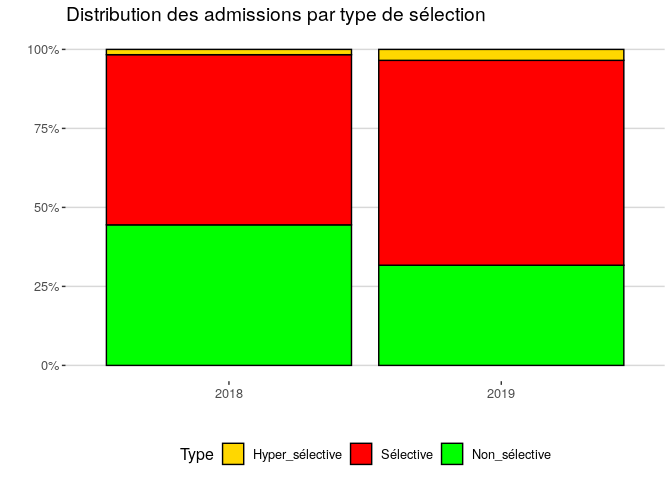<!-- -->

On constate sur ce graphique qu'un peu moins de la moitié des bacheliers ont été admis dans une filière effectivement non sélective en 2018, mais que cette proportion est tombée à un tiers en 2019. Ce taux sera amené à bouger au fil des années, selon la politique nationale d'organisation du premier cycle.


La moyenne pondérée par le nombre d'amis des taux de sélection :

```
## # A tibble: 2 x 2
##   Rentrée moyenne
##   <fct>   <chr>  
## 1 2018    84%    
## 2 2019    72%
```


### Focus sur les Licences sélectives

<!-- -->


<!-- -->


## Taux de boursiers 

Le taux de boursiers est défini comme le rapport entre le nombre d'admis néo-bacheliers boursiers, et le nombre d'admis néo-bacheliers :

<!-- $boursiers=\frac{admis.néobacheliers.boursiers}{admis.néobacheliers}$ -->
boursiers = admis néobacheliers boursiers / admis.néobacheliers


```
## Warning: Removed 19 rows containing non-finite values (stat_boxplot).
```

<!-- -->


### Taux de boursier par filières de Licences


```
## Warning: Removed 13 rows containing non-finite values (stat_boxplot).
```

<!-- -->


## Taux de mentions

Le taux de mentions se défini comme le rapport entre le nombre d'admis néo-bacheliers ayant eu une mention au bac, et le nombre d'admis néo-bacheliers. Historiquement, les mentions n'étaient pas différenciées. Aujourd'hui, on peut faire la différence entre les différente mention $x$ :

<!-- $mention_x=\frac{admis.néobacheliers.mention_x}{admis.néobacheliers}$ -->

mention_x = admis.néobacheliers.mention_x / admis.néobacheliers


```
## Warning: Removed 256 rows containing non-finite values (stat_boxplot).
```

<!-- -->


<!-- -->


## Taux de type de bac

Le taux de type du bac se défini comme le rapport entre le nombre d'admis néo-bacheliers issus d'un type de bac x, et le nombre d'admis néo-bacheliers :

<!-- $bac_x=\frac{admis.néobacheliers.bac_x}{admis.néobacheliers}$-->

bac_x = admis.néobacheliers.bac_x / admis.néobacheliers


```
## Warning: Removed 192 rows containing non-finite values (stat_boxplot).
```

<!-- -->


<!-- -->

