Jeu de données : [Parcoursup vœux de poursuite d’études et de réorientation dans l’enseignement supérieur et réponses des établissements](https://www.data.gouv.fr/fr/datasets/parcoursup-voeux-de-poursuite-detudes-et-de-reorientation-dans-lenseignement-superieur-et-reponses-des-etablissements/)

Ce jeu de données ne permet pas de percevoir les choses du côté des candidats : contrairement à ce que laisse en titre, il ne contient pas les vœux des candidats, mais seulement le nombre candidatures aux formations. 

Il permet en revanche de percevoir les choses du côté des formations.

_Attention_ : Ce jeu de données présente des incohérences :

- Effectif.total.des.candidats.ayant.accepté.la.proposition.de.l.établissement..admis. différent de la somme Effectif.des.admis.en.phase.principale + Effectif.des.admis.en.phase.complémentaire ;
- Le nombre de candidats classés par la formation peut être inférieur au nombre de candidats pour des filières non sélectives ;
- Le nombre de candidats ayant reçu une proposition peut être inférieur au nombre de candidats classés même si la formation n'atteint pas sa capacité d'accueil.

## Statistiques nationales

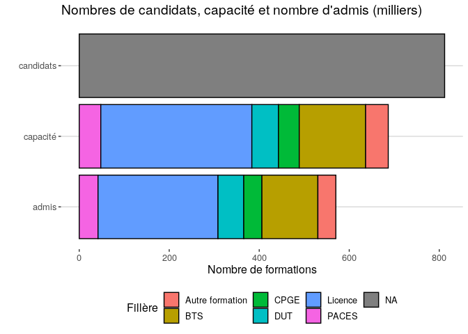<!-- -->


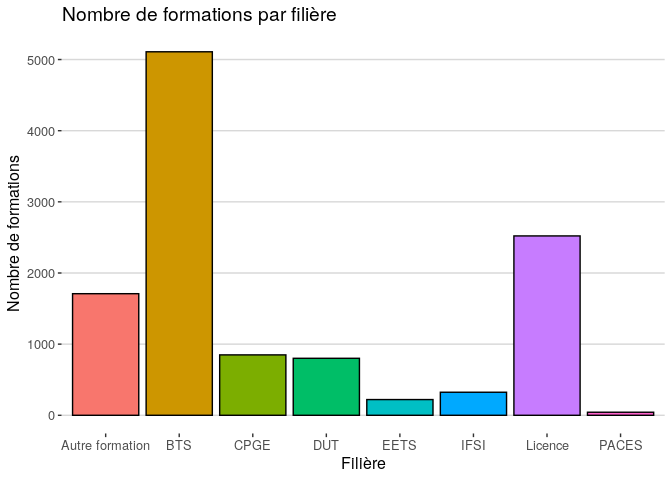<!-- -->

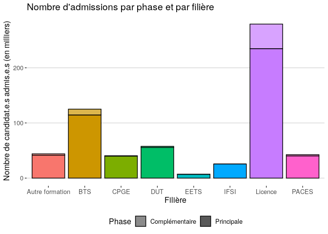<!-- -->


```
## Warning: Removed 548 rows containing non-finite values (stat_density).
```

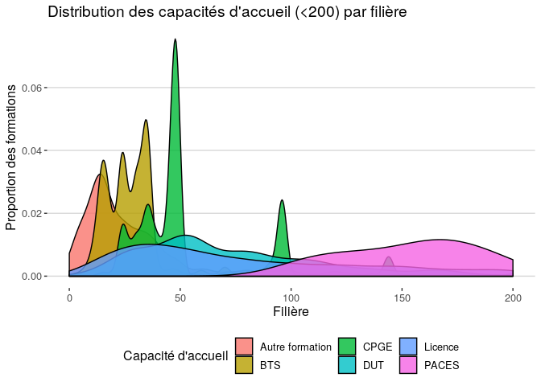<!-- -->


## Taux de tension

Le taux de tension est défini comme le rapport entre le nombre de candidatures, et les capacités d'accueil :

$tension=\frac{candidatures}{capacité}$

Limite : une formation "choix de secours" peut apparaitre en tension avec un très grand nombre de candidatures initiales, mais tout autant de désistements.

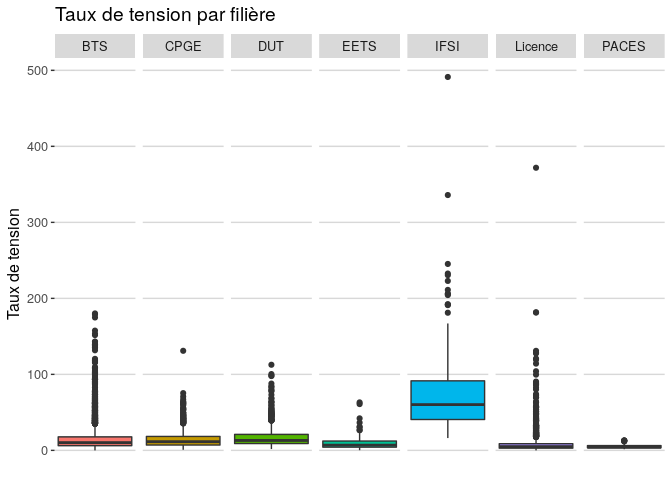<!-- -->


```
## Warning: Removed 620 rows containing non-finite values (stat_density).
```

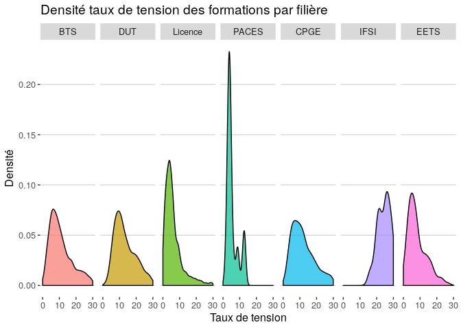<!-- -->


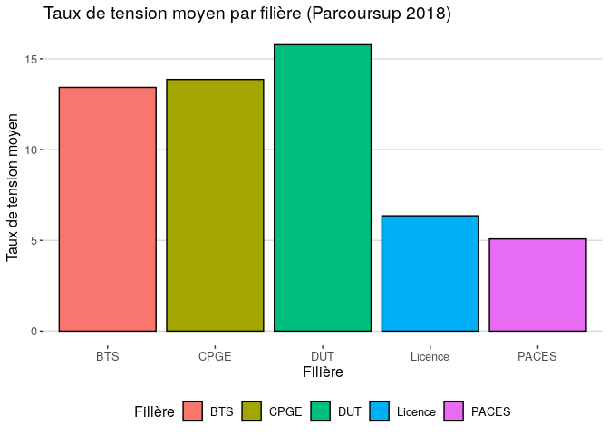<!-- -->


### Filières non sélectives (Licences) en tension

La Loi ORE dispose que : "lorsque le nombre de candidatures excède les capacités d'accueil d'une formation, les inscriptions sont prononcées par le président ou le directeur de l'établissement dans la limite des capacités d'accueil".

La proportion de Licences dites "en tension" selon cette définition est :

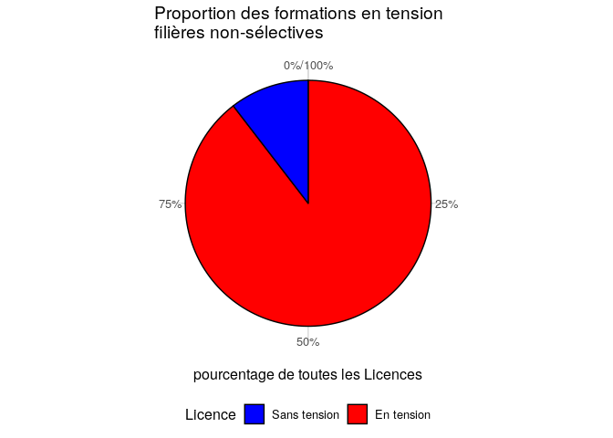<!-- -->

## Taux de remplissage

Le taux de remplissage est défini comme le rapport entre le nombre de cadnidats admis et les capacités d'accueil :

$remplissage=\frac{admis}{capacité}$


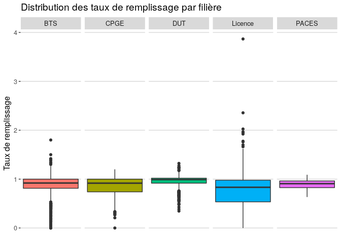<!-- -->


```
## Warning: Removed 38 rows containing non-finite values (stat_density).
```

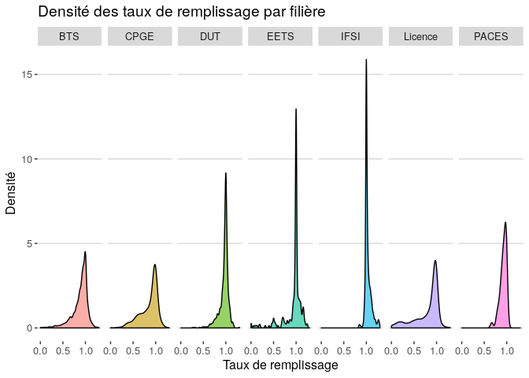<!-- -->

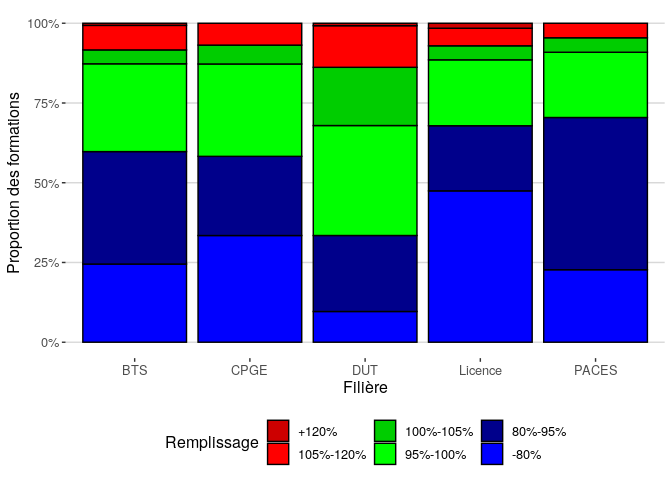<!-- -->


### Top 10

<table class="table" style="margin-left: auto; margin-right: auto;">
 <thead>
  <tr>
   <th style="text-align:left;"> Établissement </th>
   <th style="text-align:left;"> CP </th>
   <th style="text-align:left;"> Type </th>
   <th style="text-align:left;"> Filière </th>
   <th style="text-align:left;"> Détail </th>
   <th style="text-align:right;"> Capacité </th>
   <th style="text-align:right;"> Admis.phase.prin </th>
   <th style="text-align:right;"> Admis.phase.comp </th>
   <th style="text-align:left;"> Taux.de.remplissage </th>
  </tr>
 </thead>
<tbody>
  <tr>
   <td style="text-align:left;"> Université Lumière-Lyon 2 </td>
   <td style="text-align:left;"> 69 </td>
   <td style="text-align:left;"> Licence </td>
   <td style="text-align:left;"> Langues étrangères appliquées </td>
   <td style="text-align:left;"> Portail Langues : Anglais - Italien - mentions accessibles : LEA, LLCER / Programme International MINERVE </td>
   <td style="text-align:right;"> 15 </td>
   <td style="text-align:right;"> 58 </td>
   <td style="text-align:right;"> 0 </td>
   <td style="text-align:left;"> 387% </td>
  </tr>
  <tr>
   <td style="text-align:left;"> Université Lumière-Lyon 2 </td>
   <td style="text-align:left;"> 69 </td>
   <td style="text-align:left;"> Licence </td>
   <td style="text-align:left;"> Mathématiques et informatique appliquées aux sciences humaines et sociales </td>
   <td style="text-align:left;"> Portail MIASHS - mentions : Economie gestion, Géographie, Histoire, Info com, MIASHS, Psychologie, Sc et techno, Sc du langage, Sc sociales,Sociologie </td>
   <td style="text-align:right;"> 160 </td>
   <td style="text-align:right;"> 377 </td>
   <td style="text-align:right;"> 0 </td>
   <td style="text-align:left;"> 236% </td>
  </tr>
  <tr>
   <td style="text-align:left;"> Université de la Réunion - Le Tampon </td>
   <td style="text-align:left;"> 974 </td>
   <td style="text-align:left;"> Licence </td>
   <td style="text-align:left;"> Sciences pour la santé </td>
   <td style="text-align:left;">  </td>
   <td style="text-align:right;"> 120 </td>
   <td style="text-align:right;"> 131 </td>
   <td style="text-align:right;"> 112 </td>
   <td style="text-align:left;"> 202% </td>
  </tr>
  <tr>
   <td style="text-align:left;"> Université Lumière-Lyon 2 </td>
   <td style="text-align:left;"> 69 </td>
   <td style="text-align:left;"> Licence </td>
   <td style="text-align:left;"> Langues étrangères appliquées </td>
   <td style="text-align:left;"> Portail Langues : Anglais - Chinois - mentions accessibles : LEA, LLCER </td>
   <td style="text-align:right;"> 30 </td>
   <td style="text-align:right;"> 59 </td>
   <td style="text-align:right;"> 0 </td>
   <td style="text-align:left;"> 197% </td>
  </tr>
  <tr>
   <td style="text-align:left;"> Université des Antilles - Pôle Guadeloupe </td>
   <td style="text-align:left;"> 971 </td>
   <td style="text-align:left;"> Licence </td>
   <td style="text-align:left;"> Administration publique </td>
   <td style="text-align:left;"> Administration publique - Guadeloupe </td>
   <td style="text-align:right;"> 20 </td>
   <td style="text-align:right;"> 39 </td>
   <td style="text-align:right;"> 0 </td>
   <td style="text-align:left;"> 195% </td>
  </tr>
  <tr>
   <td style="text-align:left;"> Université de La Réunion - Saint Denis </td>
   <td style="text-align:left;"> 974 </td>
   <td style="text-align:left;"> Licence </td>
   <td style="text-align:left;"> Histoire </td>
   <td style="text-align:left;">  </td>
   <td style="text-align:right;"> 90 </td>
   <td style="text-align:right;"> 103 </td>
   <td style="text-align:right;"> 70 </td>
   <td style="text-align:left;"> 192% </td>
  </tr>
  <tr>
   <td style="text-align:left;"> Lycée Henri Martin </td>
   <td style="text-align:left;"> 02 </td>
   <td style="text-align:left;"> BTS </td>
   <td style="text-align:left;"> Métiers de l'audio-visuel opt : montage et post-production </td>
   <td style="text-align:left;">  </td>
   <td style="text-align:right;"> 15 </td>
   <td style="text-align:right;"> 24 </td>
   <td style="text-align:right;"> 0 </td>
   <td style="text-align:left;"> 180% </td>
  </tr>
  <tr>
   <td style="text-align:left;"> Université de La Réunion - Saint Denis </td>
   <td style="text-align:left;"> 974 </td>
   <td style="text-align:left;"> Licence </td>
   <td style="text-align:left;"> Sciences sociales </td>
   <td style="text-align:left;">  </td>
   <td style="text-align:right;"> 160 </td>
   <td style="text-align:right;"> 180 </td>
   <td style="text-align:right;"> 104 </td>
   <td style="text-align:left;"> 178% </td>
  </tr>
  <tr>
   <td style="text-align:left;"> Université Lumière-Lyon 2 </td>
   <td style="text-align:left;"> 69 </td>
   <td style="text-align:left;"> Licence </td>
   <td style="text-align:left;"> Langues étrangères appliquées </td>
   <td style="text-align:left;"> Portail Langues : Anglais - Espagnol - mentions accessibles : LEA, LLCER / Programme International MINERVE </td>
   <td style="text-align:right;"> 130 </td>
   <td style="text-align:right;"> 229 </td>
   <td style="text-align:right;"> 0 </td>
   <td style="text-align:left;"> 176% </td>
  </tr>
  <tr>
   <td style="text-align:left;"> Université de Poitiers </td>
   <td style="text-align:left;"> 86 </td>
   <td style="text-align:left;"> Licence </td>
   <td style="text-align:left;"> Langues, littératures &amp; civilisations étrangères et régionales </td>
   <td style="text-align:left;"> Portail Langues, Littératures et Civilisations Etrangères et Régionales Anglais (LLCER Anglais) / Sciences du Langage </td>
   <td style="text-align:right;"> 20 </td>
   <td style="text-align:right;"> 34 </td>
   <td style="text-align:right;"> 0 </td>
   <td style="text-align:left;"> 170% </td>
  </tr>
</tbody>
</table>

### Bottom 10

<table class="table" style="margin-left: auto; margin-right: auto;">
 <thead>
  <tr>
   <th style="text-align:left;"> Établissement </th>
   <th style="text-align:left;"> CP </th>
   <th style="text-align:left;"> Type </th>
   <th style="text-align:left;"> Filière </th>
   <th style="text-align:left;"> Détail </th>
   <th style="text-align:right;"> Capacité </th>
   <th style="text-align:right;"> Admis.phase.prin </th>
   <th style="text-align:right;"> Admis.phase.comp </th>
   <th style="text-align:left;"> Taux.de.remplissage </th>
  </tr>
 </thead>
<tbody>
  <tr>
   <td style="text-align:left;"> Université d'Orléans </td>
   <td style="text-align:left;"> 45 </td>
   <td style="text-align:left;"> Licence </td>
   <td style="text-align:left;"> Physique </td>
   <td style="text-align:left;"> Portail n° 14 - Sciences de la terre-Physique-Chimie </td>
   <td style="text-align:right;"> 125 </td>
   <td style="text-align:right;"> 0 </td>
   <td style="text-align:right;"> 0 </td>
   <td style="text-align:left;"> 0% </td>
  </tr>
  <tr>
   <td style="text-align:left;"> Institut Catholique Paris </td>
   <td style="text-align:left;"> 75 </td>
   <td style="text-align:left;"> Licence </td>
   <td style="text-align:left;"> Langues, littératures &amp; civilisations étrangères et régionales </td>
   <td style="text-align:left;"> Anglais - Allemand </td>
   <td style="text-align:right;"> 70 </td>
   <td style="text-align:right;"> 0 </td>
   <td style="text-align:right;"> 0 </td>
   <td style="text-align:left;"> 0% </td>
  </tr>
  <tr>
   <td style="text-align:left;"> INALCO </td>
   <td style="text-align:left;"> 75 </td>
   <td style="text-align:left;"> Licence </td>
   <td style="text-align:left;"> Langues, littératures &amp; civilisations étrangères et régionales </td>
   <td style="text-align:left;"> Langues, Littératures et Civilisations,  parcours Asie et Pacifique -  Népali </td>
   <td style="text-align:right;"> 55 </td>
   <td style="text-align:right;"> 0 </td>
   <td style="text-align:right;"> 0 </td>
   <td style="text-align:left;"> 0% </td>
  </tr>
  <tr>
   <td style="text-align:left;"> INALCO </td>
   <td style="text-align:left;"> 75 </td>
   <td style="text-align:left;"> Licence </td>
   <td style="text-align:left;"> Langues, littératures &amp; civilisations étrangères et régionales </td>
   <td style="text-align:left;"> Langues, Littératures et Civilisations, parcours Europe et Eurasie - Estonien </td>
   <td style="text-align:right;"> 55 </td>
   <td style="text-align:right;"> 0 </td>
   <td style="text-align:right;"> 0 </td>
   <td style="text-align:left;"> 0% </td>
  </tr>
  <tr>
   <td style="text-align:left;"> INALCO </td>
   <td style="text-align:left;"> 75 </td>
   <td style="text-align:left;"> Licence </td>
   <td style="text-align:left;"> Langues, littératures &amp; civilisations étrangères et régionales </td>
   <td style="text-align:left;"> Langues, Littératures et Civilisations, parcours Europe et Eurasie - Slovaque </td>
   <td style="text-align:right;"> 55 </td>
   <td style="text-align:right;"> 0 </td>
   <td style="text-align:right;"> 0 </td>
   <td style="text-align:left;"> 0% </td>
  </tr>
  <tr>
   <td style="text-align:left;"> INALCO </td>
   <td style="text-align:left;"> 75 </td>
   <td style="text-align:left;"> Licence </td>
   <td style="text-align:left;"> Langues, littératures &amp; civilisations étrangères et régionales </td>
   <td style="text-align:left;"> Langues, Littératures et Civilisations Etrangères et Régionales, parcours Asie et Pacifique - Télougou </td>
   <td style="text-align:right;"> 55 </td>
   <td style="text-align:right;"> 0 </td>
   <td style="text-align:right;"> 0 </td>
   <td style="text-align:left;"> 0% </td>
  </tr>
  <tr>
   <td style="text-align:left;"> INALCO </td>
   <td style="text-align:left;"> 75 </td>
   <td style="text-align:left;"> Licence </td>
   <td style="text-align:left;"> Langues, littératures &amp; civilisations étrangères et régionales </td>
   <td style="text-align:left;"> Langues, Littératures et Civilisations, parcours Europe et Eurasie - Lituanien </td>
   <td style="text-align:right;"> 55 </td>
   <td style="text-align:right;"> 0 </td>
   <td style="text-align:right;"> 0 </td>
   <td style="text-align:left;"> 0% </td>
  </tr>
  <tr>
   <td style="text-align:left;"> INALCO </td>
   <td style="text-align:left;"> 75 </td>
   <td style="text-align:left;"> Licence </td>
   <td style="text-align:left;"> Langues, littératures &amp; civilisations étrangères et régionales </td>
   <td style="text-align:left;"> Langues, Littératures et Civilisations,  parcours Asie et Pacifique -  Rromani </td>
   <td style="text-align:right;"> 55 </td>
   <td style="text-align:right;"> 0 </td>
   <td style="text-align:right;"> 0 </td>
   <td style="text-align:left;"> 0% </td>
  </tr>
  <tr>
   <td style="text-align:left;"> Université Paris- Est-Créteil Val de Marne - UPEC (Paris 12) </td>
   <td style="text-align:left;"> 94 </td>
   <td style="text-align:left;"> Licence </td>
   <td style="text-align:left;"> Langues, littératures &amp; civilisations étrangères et régionales </td>
   <td style="text-align:left;"> Allemand </td>
   <td style="text-align:right;"> 50 </td>
   <td style="text-align:right;"> 0 </td>
   <td style="text-align:right;"> 0 </td>
   <td style="text-align:left;"> 0% </td>
  </tr>
  <tr>
   <td style="text-align:left;"> Sorbonne Université - Lettres, Arts, Langues, Sciences Humaines et Sociales </td>
   <td style="text-align:left;"> 75 </td>
   <td style="text-align:left;"> Licence </td>
   <td style="text-align:left;"> Langues, littératures &amp; civilisations étrangères et régionales </td>
   <td style="text-align:left;"> LLCER ALLEMAND - LLCER NEERLANDAIS </td>
   <td style="text-align:right;"> 50 </td>
   <td style="text-align:right;"> 0 </td>
   <td style="text-align:right;"> 0 </td>
   <td style="text-align:left;"> 0% </td>
  </tr>
</tbody>
</table>

## Taux de sélection

Le taux de sélection est défini comme le rapport entre le nombre d'appelés (admis ou non, grâce au rang du dernier appelé), et le nombre de candidats en phase principale :

$sélection=\frac{rang.du.dernier.appelé}{candidats}$

Interprétation : un taux de sélection de 100% signifie que tous les candidats ont été appelés. Plus le taux est bas, plus la formation est sélective. 

_Attention_ : Théoriquement, une formation est considérée comme "Non-sélective" si et seulement si elle présente un taux de sélection de 100%. Cependant, les données présentent plusieurs défauts qui empêchent ce calcul :

- des Licences manifestement non-sélectives présentent un nombre de candidats classés légèrement inférieur au nombre de candidats (parfois de 1 ou 2 sur des milliers), qui ne peut être assimilé à de la sélection ;
- le rang du dernier appelé n'est pas disponible pour plusieurs formations, dont les DUT ;
- utiliser l'existence d'appels en phase complémentaire pour détecter les filières non-sélectives n'est pas possible puisque des places ont été ajoutées en cours de procédure.

<table class="table" style="margin-left: auto; margin-right: auto;">
 <thead>
  <tr>
   <th style="text-align:left;"> Filière.de.formation.très.agrégée </th>
   <th style="text-align:left;"> Rang.du.dernier.appelé.disponible </th>
  </tr>
 </thead>
<tbody>
  <tr>
   <td style="text-align:left;"> BTS </td>
   <td style="text-align:left;"> 23.5% </td>
  </tr>
  <tr>
   <td style="text-align:left;"> CPGE </td>
   <td style="text-align:left;"> 98.7% </td>
  </tr>
  <tr>
   <td style="text-align:left;"> DUT </td>
   <td style="text-align:left;"> 6.0% </td>
  </tr>
  <tr>
   <td style="text-align:left;"> Licence </td>
   <td style="text-align:left;"> 98.6% </td>
  </tr>
  <tr>
   <td style="text-align:left;"> PACES </td>
   <td style="text-align:left;"> 95.5% </td>
  </tr>
</tbody>
</table>

C'est pourquoi, est considérée comme :

- "Non-sélective" : les formation dont le taux de sélection est supérieur ou égal à 95%. Pour des questions de lisibilité, leur taux de sélection est forcé à 100% ;
- "Sélective" : les formation dont le taux de sélection est inférieur à 95% ;
- "Hyper-Sélective" : les formation dont le taux de sélection est inférieur à 20%.

_NB_ : 

- Avec cette interprétation, il est possible que des formation ayant éliminé quelques candidats soient considérées comme non-sélectives.
- Les statistiques sur les formations et les établissements se basent sur les données disponibles, celles sur les candidats considèrent BTS, CPGE et DUT comme sélectives, et Licence et PACES comme non sélectives.


```
## Warning: Removed 4694 rows containing non-finite values (stat_boxplot).
```

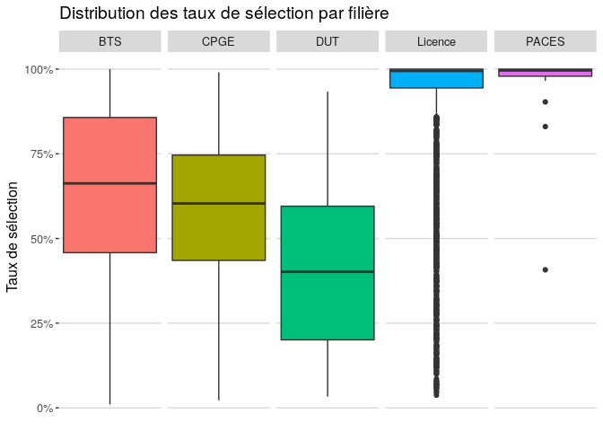<!-- -->


```
## Warning: Removed 4657 rows containing non-finite values (stat_density).
```

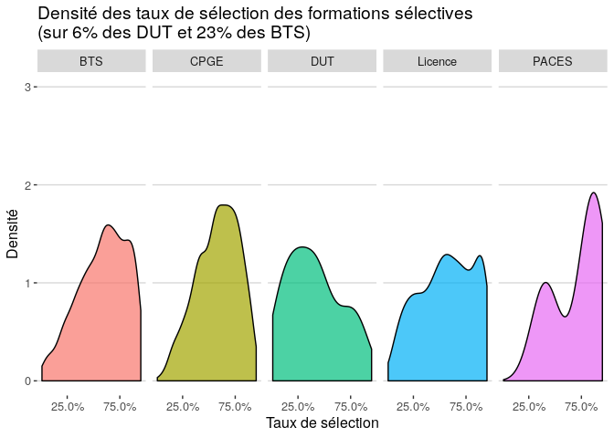<!-- -->


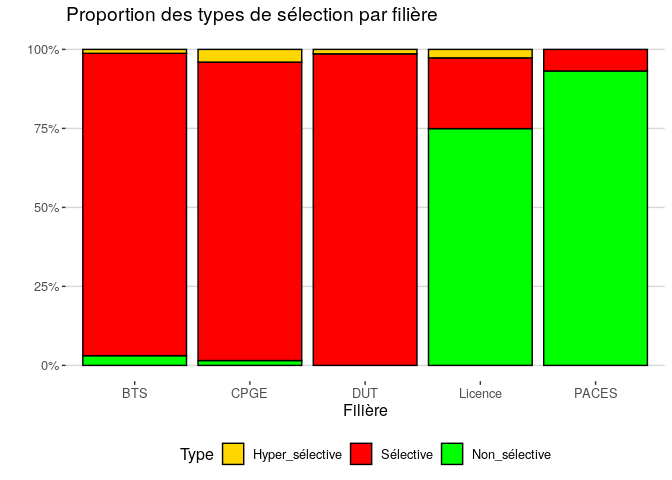<!-- -->

### Top 10

<table class="table" style="margin-left: auto; margin-right: auto;">
 <thead>
  <tr>
   <th style="text-align:left;"> Établissement </th>
   <th style="text-align:left;"> CP </th>
   <th style="text-align:left;"> Type </th>
   <th style="text-align:left;"> Filière </th>
   <th style="text-align:right;"> Capacité </th>
   <th style="text-align:right;"> Candidats </th>
   <th style="text-align:right;"> Rang.du.dernier.appelé </th>
   <th style="text-align:left;"> Taux.de.sélection </th>
  </tr>
 </thead>
<tbody>
  <tr>
   <td style="text-align:left;"> Lycée Leonard de Vinci </td>
   <td style="text-align:left;"> 85 </td>
   <td style="text-align:left;"> BTS </td>
   <td style="text-align:left;"> Métiers de l'audio-visuel opt : métiers de l'image </td>
   <td style="text-align:right;"> 8 </td>
   <td style="text-align:right;"> 981 </td>
   <td style="text-align:right;"> 10 </td>
   <td style="text-align:left;"> 1.02% </td>
  </tr>
  <tr>
   <td style="text-align:left;"> Lycée Leonard de Vinci </td>
   <td style="text-align:left;"> 85 </td>
   <td style="text-align:left;"> BTS </td>
   <td style="text-align:left;"> Métiers de l'audio-visuel opt : montage et post-production </td>
   <td style="text-align:right;"> 8 </td>
   <td style="text-align:right;"> 969 </td>
   <td style="text-align:right;"> 11 </td>
   <td style="text-align:left;"> 1.14% </td>
  </tr>
  <tr>
   <td style="text-align:left;"> Lycée Carnot </td>
   <td style="text-align:left;"> 06 </td>
   <td style="text-align:left;"> BTS </td>
   <td style="text-align:left;"> Métiers de l'audio-visuel opt : métiers du son </td>
   <td style="text-align:right;"> 8 </td>
   <td style="text-align:right;"> 732 </td>
   <td style="text-align:right;"> 12 </td>
   <td style="text-align:left;"> 1.64% </td>
  </tr>
  <tr>
   <td style="text-align:left;"> Lycée Leonard de Vinci </td>
   <td style="text-align:left;"> 85 </td>
   <td style="text-align:left;"> BTS </td>
   <td style="text-align:left;"> Métiers de l'audio-visuel opt : métiers du son </td>
   <td style="text-align:right;"> 8 </td>
   <td style="text-align:right;"> 729 </td>
   <td style="text-align:right;"> 15 </td>
   <td style="text-align:left;"> 2.06% </td>
  </tr>
  <tr>
   <td style="text-align:left;"> Lycée Carnot </td>
   <td style="text-align:left;"> 06 </td>
   <td style="text-align:left;"> BTS </td>
   <td style="text-align:left;"> Métiers de l'audio-visuel opt : métiers de l'image </td>
   <td style="text-align:right;"> 8 </td>
   <td style="text-align:right;"> 1066 </td>
   <td style="text-align:right;"> 22 </td>
   <td style="text-align:left;"> 2.06% </td>
  </tr>
  <tr>
   <td style="text-align:left;"> Lycée Edouard Branly </td>
   <td style="text-align:left;"> 69 </td>
   <td style="text-align:left;"> BTS </td>
   <td style="text-align:left;"> Systèmes numériques - Option informatique et réseaux </td>
   <td style="text-align:right;"> 2 </td>
   <td style="text-align:right;"> 140 </td>
   <td style="text-align:right;"> 3 </td>
   <td style="text-align:left;"> 2.14% </td>
  </tr>
  <tr>
   <td style="text-align:left;"> Lycée Henri IV </td>
   <td style="text-align:left;"> 75 </td>
   <td style="text-align:left;"> CPGE </td>
   <td style="text-align:left;"> Option économique - Prépa St Cyr </td>
   <td style="text-align:right;"> 2 </td>
   <td style="text-align:right;"> 180 </td>
   <td style="text-align:right;"> 4 </td>
   <td style="text-align:left;"> 2.22% </td>
  </tr>
  <tr>
   <td style="text-align:left;"> Lycée Carnot </td>
   <td style="text-align:left;"> 06 </td>
   <td style="text-align:left;"> BTS </td>
   <td style="text-align:left;"> Métiers de l'audio-visuel opt : montage et post-production </td>
   <td style="text-align:right;"> 8 </td>
   <td style="text-align:right;"> 935 </td>
   <td style="text-align:right;"> 23 </td>
   <td style="text-align:left;"> 2.46% </td>
  </tr>
  <tr>
   <td style="text-align:left;"> I.U.T. 2 de Grenoble </td>
   <td style="text-align:left;"> 38 </td>
   <td style="text-align:left;"> DUT </td>
   <td style="text-align:left;"> Carrières sociales Option éducation spécialisée </td>
   <td style="text-align:right;"> 28 </td>
   <td style="text-align:right;"> 1382 </td>
   <td style="text-align:right;"> 46 </td>
   <td style="text-align:left;"> 3.33% </td>
  </tr>
  <tr>
   <td style="text-align:left;"> Lycée Edouard Branly </td>
   <td style="text-align:left;"> 69 </td>
   <td style="text-align:left;"> BTS </td>
   <td style="text-align:left;"> Electrotechnique </td>
   <td style="text-align:right;"> 2 </td>
   <td style="text-align:right;"> 85 </td>
   <td style="text-align:right;"> 3 </td>
   <td style="text-align:left;"> 3.53% </td>
  </tr>
</tbody>
</table>

### Bottom 10

<table class="table" style="margin-left: auto; margin-right: auto;">
 <thead>
  <tr>
   <th style="text-align:left;"> Établissement </th>
   <th style="text-align:left;"> CP </th>
   <th style="text-align:left;"> Type </th>
   <th style="text-align:left;"> Filière </th>
   <th style="text-align:right;"> Capacité </th>
   <th style="text-align:right;"> Candidats </th>
   <th style="text-align:right;"> Rang.du.dernier.appelé </th>
   <th style="text-align:left;"> Taux.de.sélection </th>
  </tr>
 </thead>
<tbody>
  <tr>
   <td style="text-align:left;"> Université Claude Bernard Lyon 1 </td>
   <td style="text-align:left;"> 69 </td>
   <td style="text-align:left;"> PACES </td>
   <td style="text-align:left;"> PACES - Médecine, Pharmacie, Odontologie (dentiste), Maïeutique (sage-femmes) </td>
   <td style="text-align:right;"> 2550 </td>
   <td style="text-align:right;"> 8589 </td>
   <td style="text-align:right;"> 8589 </td>
   <td style="text-align:left;"> 100% </td>
  </tr>
  <tr>
   <td style="text-align:left;"> Université Toulouse 3 Paul Sabatier </td>
   <td style="text-align:left;"> 31 </td>
   <td style="text-align:left;"> PACES </td>
   <td style="text-align:left;"> PACES - Médecine, Pharmacie, Odontologie (dentiste), Maïeutique (sage-femmes) </td>
   <td style="text-align:right;"> 3000 </td>
   <td style="text-align:right;"> 6476 </td>
   <td style="text-align:right;"> 6476 </td>
   <td style="text-align:left;"> 100% </td>
  </tr>
  <tr>
   <td style="text-align:left;"> Université de Montpellier </td>
   <td style="text-align:left;"> 34 </td>
   <td style="text-align:left;"> PACES </td>
   <td style="text-align:left;"> PACES - Médecine, Pharmacie, Odontologie (dentiste), Maïeutique (sage-femmes) </td>
   <td style="text-align:right;"> 1800 </td>
   <td style="text-align:right;"> 6428 </td>
   <td style="text-align:right;"> 6428 </td>
   <td style="text-align:left;"> 100% </td>
  </tr>
  <tr>
   <td style="text-align:left;"> Université de Nantes </td>
   <td style="text-align:left;"> 44 </td>
   <td style="text-align:left;"> PACES </td>
   <td style="text-align:left;"> PACES - Médecine, Pharmacie, Odontologie (dentiste), Maïeutique (sage-femmes) </td>
   <td style="text-align:right;"> 1210 </td>
   <td style="text-align:right;"> 5621 </td>
   <td style="text-align:right;"> 5621 </td>
   <td style="text-align:left;"> 100% </td>
  </tr>
  <tr>
   <td style="text-align:left;"> UNIVERSITE GRENOBLE ALPES </td>
   <td style="text-align:left;"> 38 </td>
   <td style="text-align:left;"> PACES </td>
   <td style="text-align:left;"> PACES - Médecine, Pharmacie, Odontologie (dentiste), Maïeutique (sage-femmes) </td>
   <td style="text-align:right;"> 1100 </td>
   <td style="text-align:right;"> 4227 </td>
   <td style="text-align:right;"> 4227 </td>
   <td style="text-align:left;"> 100% </td>
  </tr>
  <tr>
   <td style="text-align:left;"> Université Lumière-Lyon 2 </td>
   <td style="text-align:left;"> 69 </td>
   <td style="text-align:left;"> Licence </td>
   <td style="text-align:left;"> Droit </td>
   <td style="text-align:right;"> 570 </td>
   <td style="text-align:right;"> 4002 </td>
   <td style="text-align:right;"> 4002 </td>
   <td style="text-align:left;"> 100% </td>
  </tr>
  <tr>
   <td style="text-align:left;"> Université de Nantes </td>
   <td style="text-align:left;"> 44 </td>
   <td style="text-align:left;"> Licence </td>
   <td style="text-align:left;"> Economie et gestion </td>
   <td style="text-align:right;"> 430 </td>
   <td style="text-align:right;"> 3618 </td>
   <td style="text-align:right;"> 3618 </td>
   <td style="text-align:left;"> 100% </td>
  </tr>
  <tr>
   <td style="text-align:left;"> Université de Reims Champagne-Ardenne </td>
   <td style="text-align:left;"> 51 </td>
   <td style="text-align:left;"> PACES </td>
   <td style="text-align:left;"> PACES - Médecine, Pharmacie, Odontologie (dentiste), Maïeutique (sage-femmes) </td>
   <td style="text-align:right;"> 940 </td>
   <td style="text-align:right;"> 2997 </td>
   <td style="text-align:right;"> 2997 </td>
   <td style="text-align:left;"> 100% </td>
  </tr>
  <tr>
   <td style="text-align:left;"> Université Paris 1 Panthéon Sorbonne </td>
   <td style="text-align:left;"> 75 </td>
   <td style="text-align:left;"> Licence </td>
   <td style="text-align:left;"> Histoire </td>
   <td style="text-align:right;"> 630 </td>
   <td style="text-align:right;"> 2964 </td>
   <td style="text-align:right;"> 2964 </td>
   <td style="text-align:left;"> 100% </td>
  </tr>
  <tr>
   <td style="text-align:left;"> Université de Montpellier </td>
   <td style="text-align:left;"> 34 </td>
   <td style="text-align:left;"> Licence </td>
   <td style="text-align:left;"> Economie </td>
   <td style="text-align:right;"> 345 </td>
   <td style="text-align:right;"> 2806 </td>
   <td style="text-align:right;"> 2806 </td>
   <td style="text-align:left;"> 100% </td>
  </tr>
</tbody>
</table>

### Filières non-sélectives (Licences)


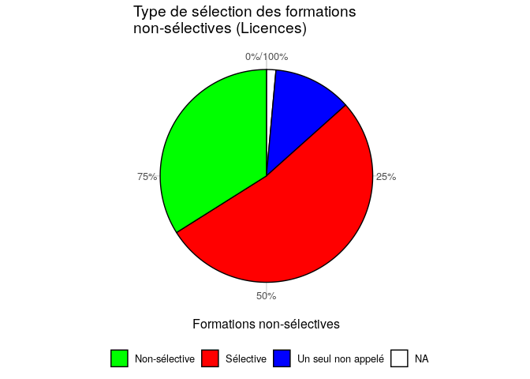<!-- -->


```
## Warning: Removed 95 rows containing non-finite values (stat_density).
```

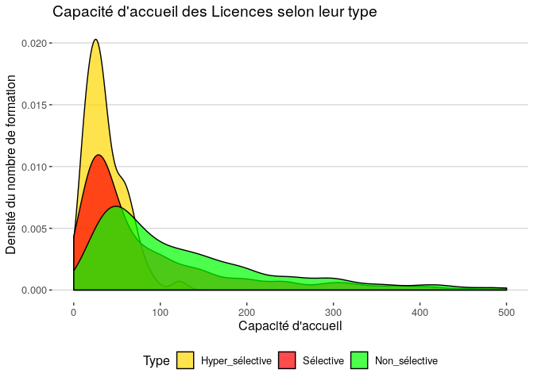<!-- -->


<table class="table" style="margin-left: auto; margin-right: auto;">
 <thead>
  <tr>
   <th style="text-align:left;"> Établissement </th>
   <th style="text-align:left;"> CP </th>
   <th style="text-align:left;"> Type </th>
   <th style="text-align:left;"> Filière </th>
   <th style="text-align:right;"> Capacité </th>
   <th style="text-align:right;"> Candidats </th>
   <th style="text-align:right;"> Rang.du.dernier.appelé </th>
   <th style="text-align:left;"> Taux.de.sélection </th>
  </tr>
 </thead>
<tbody>
  <tr>
   <td style="text-align:left;"> Université Paris-Sud, campus d'Orsay </td>
   <td style="text-align:left;"> 91 </td>
   <td style="text-align:left;"> Licence </td>
   <td style="text-align:left;"> Sciences pour l'ingénieur </td>
   <td style="text-align:right;"> 30 </td>
   <td style="text-align:right;"> 1360 </td>
   <td style="text-align:right;"> 51 </td>
   <td style="text-align:left;"> 3.75% </td>
  </tr>
  <tr>
   <td style="text-align:left;"> Université Paris- Est- Créteil Val de Marne UPEC - Antenne de Sénart </td>
   <td style="text-align:left;"> 77 </td>
   <td style="text-align:left;"> Licence </td>
   <td style="text-align:left;"> Economie et gestion </td>
   <td style="text-align:right;"> 32 </td>
   <td style="text-align:right;"> 1057 </td>
   <td style="text-align:right;"> 48 </td>
   <td style="text-align:left;"> 4.54% </td>
  </tr>
  <tr>
   <td style="text-align:left;"> Université Paris 1 Panthéon Sorbonne </td>
   <td style="text-align:left;"> 75 </td>
   <td style="text-align:left;"> Licence </td>
   <td style="text-align:left;"> Droit </td>
   <td style="text-align:right;"> 25 </td>
   <td style="text-align:right;"> 726 </td>
   <td style="text-align:right;"> 35 </td>
   <td style="text-align:left;"> 4.82% </td>
  </tr>
  <tr>
   <td style="text-align:left;"> Université Paris 1 Panthéon Sorbonne </td>
   <td style="text-align:left;"> 75 </td>
   <td style="text-align:left;"> Licence </td>
   <td style="text-align:left;"> Science politique </td>
   <td style="text-align:right;"> 65 </td>
   <td style="text-align:right;"> 6556 </td>
   <td style="text-align:right;"> 363 </td>
   <td style="text-align:left;"> 5.54% </td>
  </tr>
  <tr>
   <td style="text-align:left;"> Université Paris- Est-Créteil Val de Marne - UPEC (Paris 12) </td>
   <td style="text-align:left;"> 94 </td>
   <td style="text-align:left;"> Licence </td>
   <td style="text-align:left;"> Economie et gestion </td>
   <td style="text-align:right;"> 30 </td>
   <td style="text-align:right;"> 1245 </td>
   <td style="text-align:right;"> 71 </td>
   <td style="text-align:left;"> 5.70% </td>
  </tr>
  <tr>
   <td style="text-align:left;"> Universite de Lille - Campus Moulin Ronchin - Lille </td>
   <td style="text-align:left;"> 59 </td>
   <td style="text-align:left;"> Licence </td>
   <td style="text-align:left;"> Sciences et Techniques des Activités Physiques et Sportives </td>
   <td style="text-align:right;"> 15 </td>
   <td style="text-align:right;"> 285 </td>
   <td style="text-align:right;"> 17 </td>
   <td style="text-align:left;"> 5.96% </td>
  </tr>
  <tr>
   <td style="text-align:left;"> Université de Lille - Campus Pont de Bois - Villeneuve d'Ascq </td>
   <td style="text-align:left;"> 59 </td>
   <td style="text-align:left;"> Licence </td>
   <td style="text-align:left;"> Economie et gestion </td>
   <td style="text-align:right;"> 25 </td>
   <td style="text-align:right;"> 525 </td>
   <td style="text-align:right;"> 32 </td>
   <td style="text-align:left;"> 6.10% </td>
  </tr>
  <tr>
   <td style="text-align:left;"> IPC-Facultés Libres de Philosophie et de Psycholog </td>
   <td style="text-align:left;"> 75 </td>
   <td style="text-align:left;"> Licence </td>
   <td style="text-align:left;"> Psychologie </td>
   <td style="text-align:right;"> 20 </td>
   <td style="text-align:right;"> 632 </td>
   <td style="text-align:right;"> 41 </td>
   <td style="text-align:left;"> 6.49% </td>
  </tr>
  <tr>
   <td style="text-align:left;"> Université de Bordeaux - Bordeaux Métropole </td>
   <td style="text-align:left;"> 33 </td>
   <td style="text-align:left;"> Licence </td>
   <td style="text-align:left;"> Droit </td>
   <td style="text-align:right;"> 90 </td>
   <td style="text-align:right;"> 2016 </td>
   <td style="text-align:right;"> 135 </td>
   <td style="text-align:left;"> 6.70% </td>
  </tr>
  <tr>
   <td style="text-align:left;"> Université Paris 2 Panthéon - Assas </td>
   <td style="text-align:left;"> 75 </td>
   <td style="text-align:left;"> Licence </td>
   <td style="text-align:left;"> Information et communication </td>
   <td style="text-align:right;"> 50 </td>
   <td style="text-align:right;"> 5408 </td>
   <td style="text-align:right;"> 370 </td>
   <td style="text-align:left;"> 6.84% </td>
  </tr>
</tbody>
</table>


### Par établissements

Le taux de Licences sélective est défini comme le rapport entre le nombre de Licences sélectives, et le nombre total de Licences.

_Attention_ : Dans le jeu de données, les établissements de grande taille sont éclatés par site.


  

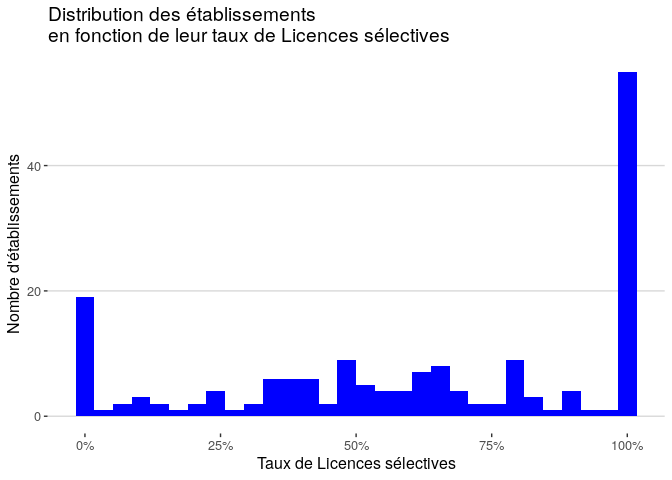<!-- -->

### Top 10  

TSM : Taux de Sélection Moyen des Licences sélectives

<table class="table" style="margin-left: auto; margin-right: auto;">
 <thead>
  <tr>
   <th style="text-align:left;"> Établissement </th>
   <th style="text-align:right;"> Nb.L </th>
   <th style="text-align:right;"> Nb_Sélective </th>
   <th style="text-align:left;"> Taux_Sélective </th>
   <th style="text-align:left;"> TSM_Sélective </th>
  </tr>
 </thead>
<tbody>
  <tr>
   <td style="text-align:left;"> Institut Catholique de Lyon </td>
   <td style="text-align:right;"> 9 </td>
   <td style="text-align:right;"> 9 </td>
   <td style="text-align:left;"> 100% </td>
   <td style="text-align:left;"> 69.0% </td>
  </tr>
  <tr>
   <td style="text-align:left;"> Université Paris-Sud, campus de Sceaux </td>
   <td style="text-align:right;"> 6 </td>
   <td style="text-align:right;"> 6 </td>
   <td style="text-align:left;"> 100% </td>
   <td style="text-align:left;"> 49.9% </td>
  </tr>
  <tr>
   <td style="text-align:left;"> Institut Catholique de Lille-Faculté de Gestion, Economie et Sciences </td>
   <td style="text-align:right;"> 6 </td>
   <td style="text-align:right;"> 6 </td>
   <td style="text-align:left;"> 100% </td>
   <td style="text-align:left;"> 54.8% </td>
  </tr>
  <tr>
   <td style="text-align:left;"> Université Paris 13 - Antenne de Bobigny </td>
   <td style="text-align:right;"> 4 </td>
   <td style="text-align:right;"> 4 </td>
   <td style="text-align:left;"> 100% </td>
   <td style="text-align:left;"> 52.1% </td>
  </tr>
  <tr>
   <td style="text-align:left;"> Institut Supérieur de l'Enseignement Privé de Polynésie </td>
   <td style="text-align:right;"> 4 </td>
   <td style="text-align:right;"> 4 </td>
   <td style="text-align:left;"> 100% </td>
   <td style="text-align:left;"> 57.5% </td>
  </tr>
  <tr>
   <td style="text-align:left;"> Sorbonne Université - Sciences et Ingénierie </td>
   <td style="text-align:right;"> 4 </td>
   <td style="text-align:right;"> 4 </td>
   <td style="text-align:left;"> 100% </td>
   <td style="text-align:left;"> 65.7% </td>
  </tr>
  <tr>
   <td style="text-align:left;"> CNAM de Franche-Comté site de Besançon et CNAM de Franche-Comté site de Belfort </td>
   <td style="text-align:right;"> 3 </td>
   <td style="text-align:right;"> 3 </td>
   <td style="text-align:left;"> 100% </td>
   <td style="text-align:left;"> 20.2% </td>
  </tr>
  <tr>
   <td style="text-align:left;"> Université Paris 2 Panthéon - Assas </td>
   <td style="text-align:right;"> 3 </td>
   <td style="text-align:right;"> 3 </td>
   <td style="text-align:left;"> 100% </td>
   <td style="text-align:left;"> 36.0% </td>
  </tr>
  <tr>
   <td style="text-align:left;"> Université d'Artois - Site de Liévin </td>
   <td style="text-align:right;"> 3 </td>
   <td style="text-align:right;"> 3 </td>
   <td style="text-align:left;"> 100% </td>
   <td style="text-align:left;"> 52.2% </td>
  </tr>
  <tr>
   <td style="text-align:left;"> IPC-Facultés Libres de Philosophie et de Psycholog </td>
   <td style="text-align:right;"> 2 </td>
   <td style="text-align:right;"> 2 </td>
   <td style="text-align:left;"> 100% </td>
   <td style="text-align:left;"> 25.1% </td>
  </tr>
</tbody>
</table>


<table class="table" style="margin-left: auto; margin-right: auto;">
 <thead>
  <tr>
   <th style="text-align:left;"> Établissement </th>
   <th style="text-align:right;"> Nb.L </th>
   <th style="text-align:right;"> Nb_Sélective </th>
   <th style="text-align:left;"> Taux_Sélective </th>
   <th style="text-align:left;"> TSM_Sélective </th>
  </tr>
 </thead>
<tbody>
  <tr>
   <td style="text-align:left;"> Université Paris 1 Panthéon Sorbonne </td>
   <td style="text-align:right;"> 35 </td>
   <td style="text-align:right;"> 30 </td>
   <td style="text-align:left;"> 85.7% </td>
   <td style="text-align:left;"> 41.0% </td>
  </tr>
  <tr>
   <td style="text-align:left;"> Université Sorbonne Nouvelle Paris 3 </td>
   <td style="text-align:right;"> 47 </td>
   <td style="text-align:right;"> 29 </td>
   <td style="text-align:left;"> 61.7% </td>
   <td style="text-align:left;"> 56.1% </td>
  </tr>
  <tr>
   <td style="text-align:left;"> Université Jean Moulin Lyon 3 </td>
   <td style="text-align:right;"> 63 </td>
   <td style="text-align:right;"> 28 </td>
   <td style="text-align:left;"> 44.4% </td>
   <td style="text-align:left;"> 67.5% </td>
  </tr>
  <tr>
   <td style="text-align:left;"> Université Paris- Est-Créteil Val de Marne - UPEC (Paris 12) </td>
   <td style="text-align:right;"> 43 </td>
   <td style="text-align:right;"> 26 </td>
   <td style="text-align:left;"> 60.5% </td>
   <td style="text-align:left;"> 44.4% </td>
  </tr>
  <tr>
   <td style="text-align:left;"> Université Paris Nanterre </td>
   <td style="text-align:right;"> 63 </td>
   <td style="text-align:right;"> 21 </td>
   <td style="text-align:left;"> 33.3% </td>
   <td style="text-align:left;"> 66.1% </td>
  </tr>
  <tr>
   <td style="text-align:left;"> Université Paris Diderot - Paris 7 </td>
   <td style="text-align:right;"> 30 </td>
   <td style="text-align:right;"> 18 </td>
   <td style="text-align:left;"> 60.0% </td>
   <td style="text-align:left;"> 52.3% </td>
  </tr>
  <tr>
   <td style="text-align:left;"> UNIVERSITE GRENOBLE ALPES </td>
   <td style="text-align:right;"> 57 </td>
   <td style="text-align:right;"> 17 </td>
   <td style="text-align:left;"> 29.8% </td>
   <td style="text-align:left;"> 65.5% </td>
  </tr>
  <tr>
   <td style="text-align:left;"> Université Bordeaux Montaigne </td>
   <td style="text-align:right;"> 40 </td>
   <td style="text-align:right;"> 16 </td>
   <td style="text-align:left;"> 40.0% </td>
   <td style="text-align:left;"> 53.0% </td>
  </tr>
  <tr>
   <td style="text-align:left;"> Université Paris-Sud, campus d'Orsay </td>
   <td style="text-align:right;"> 17 </td>
   <td style="text-align:right;"> 15 </td>
   <td style="text-align:left;"> 88.2% </td>
   <td style="text-align:left;"> 56.8% </td>
  </tr>
  <tr>
   <td style="text-align:left;"> Université de Lille - Campus Pont de Bois - Villeneuve d'Ascq </td>
   <td style="text-align:right;"> 47 </td>
   <td style="text-align:right;"> 14 </td>
   <td style="text-align:left;"> 29.8% </td>
   <td style="text-align:left;"> 34.3% </td>
  </tr>
</tbody>
</table>

<table class="table" style="margin-left: auto; margin-right: auto;">
 <thead>
  <tr>
   <th style="text-align:left;"> Établissement </th>
   <th style="text-align:right;"> Nb.L </th>
   <th style="text-align:right;"> Nb_Sélective </th>
   <th style="text-align:left;"> Taux_Sélective </th>
   <th style="text-align:left;"> TSM_Sélective </th>
  </tr>
 </thead>
<tbody>
  <tr>
   <td style="text-align:left;"> Université de Versailles - Saint Quentin en Yvelines - Antenne de Guyancourt </td>
   <td style="text-align:right;"> 13 </td>
   <td style="text-align:right;"> 1 </td>
   <td style="text-align:left;"> 7.69% </td>
   <td style="text-align:left;"> 13.7% </td>
  </tr>
  <tr>
   <td style="text-align:left;"> CNAM de Franche-Comté site de Besançon et CNAM de Franche-Comté site de Belfort </td>
   <td style="text-align:right;"> 3 </td>
   <td style="text-align:right;"> 3 </td>
   <td style="text-align:left;"> 100% </td>
   <td style="text-align:left;"> 20.2% </td>
  </tr>
  <tr>
   <td style="text-align:left;"> IPC-Facultés Libres de Philosophie et de Psycholog </td>
   <td style="text-align:right;"> 2 </td>
   <td style="text-align:right;"> 2 </td>
   <td style="text-align:left;"> 100% </td>
   <td style="text-align:left;"> 25.1% </td>
  </tr>
  <tr>
   <td style="text-align:left;"> Institut Catholique de Lille - ESPAS </td>
   <td style="text-align:right;"> 1 </td>
   <td style="text-align:right;"> 1 </td>
   <td style="text-align:left;"> 100% </td>
   <td style="text-align:left;"> 25.5% </td>
  </tr>
  <tr>
   <td style="text-align:left;"> Université de Mulhouse - Site de Colmar - Faculté de marketing et d'agrosciences </td>
   <td style="text-align:right;"> 2 </td>
   <td style="text-align:right;"> 2 </td>
   <td style="text-align:left;"> 100% </td>
   <td style="text-align:left;"> 27.5% </td>
  </tr>
  <tr>
   <td style="text-align:left;"> Université Paris- Est- Créteil Val de Marne UPEC - Antenne de Sénart </td>
   <td style="text-align:right;"> 3 </td>
   <td style="text-align:right;"> 2 </td>
   <td style="text-align:left;"> 66.7% </td>
   <td style="text-align:left;"> 29.0% </td>
  </tr>
  <tr>
   <td style="text-align:left;"> Universite de Lille - Campus Moulin Ronchin - Lille </td>
   <td style="text-align:right;"> 10 </td>
   <td style="text-align:right;"> 7 </td>
   <td style="text-align:left;"> 70.0% </td>
   <td style="text-align:left;"> 29.4% </td>
  </tr>
  <tr>
   <td style="text-align:left;"> Université de Bordeaux - Bordeaux Métropole </td>
   <td style="text-align:right;"> 22 </td>
   <td style="text-align:right;"> 11 </td>
   <td style="text-align:left;"> 50.0% </td>
   <td style="text-align:left;"> 31.6% </td>
  </tr>
  <tr>
   <td style="text-align:left;"> Université de Perpignan Via Domitia </td>
   <td style="text-align:right;"> 19 </td>
   <td style="text-align:right;"> 2 </td>
   <td style="text-align:left;"> 10.5% </td>
   <td style="text-align:left;"> 31.8% </td>
  </tr>
  <tr>
   <td style="text-align:left;"> Université Le Havre Normandie </td>
   <td style="text-align:right;"> 19 </td>
   <td style="text-align:right;"> 4 </td>
   <td style="text-align:left;"> 21.1% </td>
   <td style="text-align:left;"> 33.3% </td>
  </tr>
</tbody>
</table>

### La sélection par candidats

La sélection par candidat permet d'évaluer la sélectivité du système d'orientation supérieur.


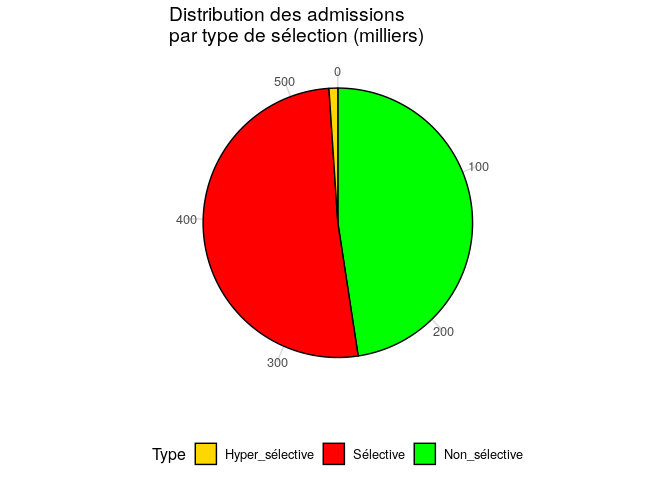<!-- -->

La moyenne pondérée par le nombre d'amis des taux de sélection :

```
## [1] "86.3%"
```


### Focus sur les Licences sélectives

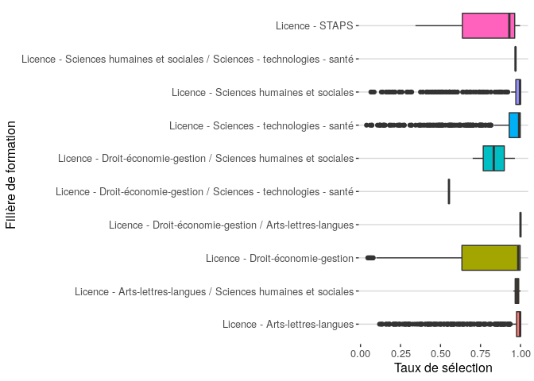<!-- -->


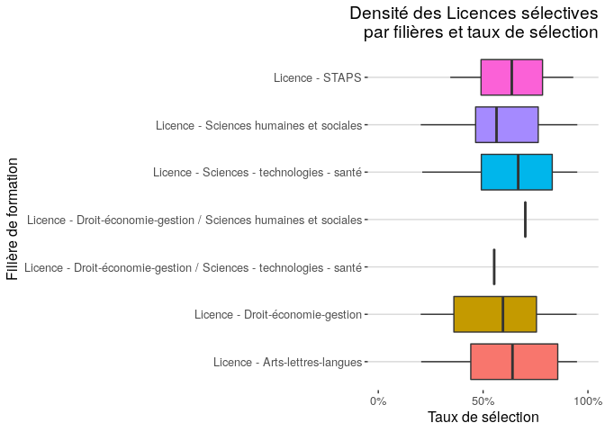<!-- -->


## Taux de boursiers 

Le taux de boursiers est défini comme le rapport entre le nombre d'admis néo-bacheliers boursiers, et le nombre d'admis néo-bacheliers :

$boursiers=\frac{admis.néobacheliers.boursiers}{admis.néobacheliers}$


```
## Warning: Removed 64 rows containing non-finite values (stat_boxplot).
```

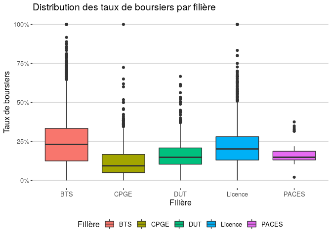<!-- -->

Densité des formations ayant moins de 50% de boursiers parmis les néo-bacheliers admis :


```
## Warning: Removed 480 rows containing non-finite values (stat_density).
```

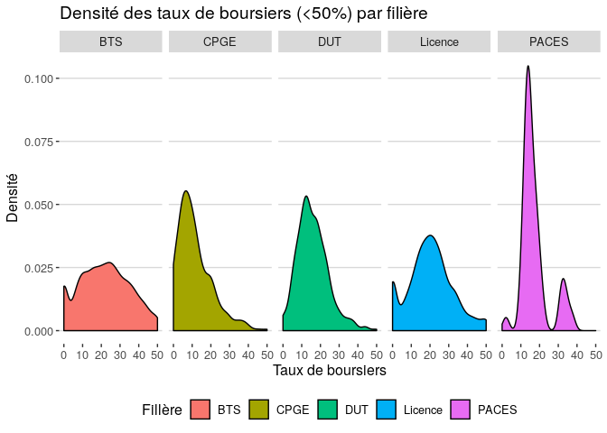<!-- -->

### Taux de boursier par filières de Licences


```
## Warning: Removed 56 rows containing non-finite values (stat_boxplot).
```

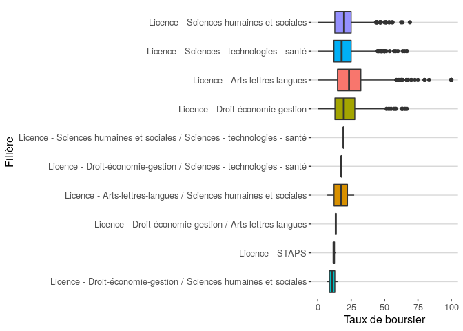<!-- -->


## Taux de mentions

Le taux de mentions se défini comme le rapport entre le nombre d'admis néo-bacheliers ayant eu une mention au bac, et le nombre d'admis néo-bacheliers. Historiquement, les mentions n'étaient pas différenciées. Aujourd'hui, on peut faire la différence entre les différente mention $x$ :

$mention_x=\frac{admis.néobacheliers.mention_x}{admis.néobacheliers}$


```
## Warning: Removed 256 rows containing non-finite values (stat_boxplot).
```

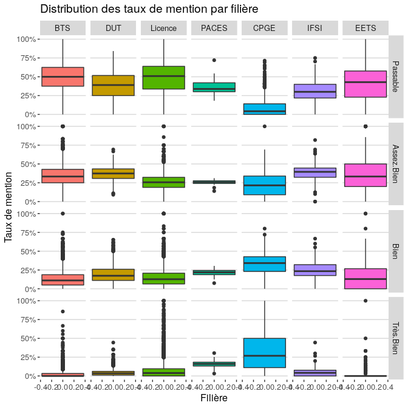<!-- -->


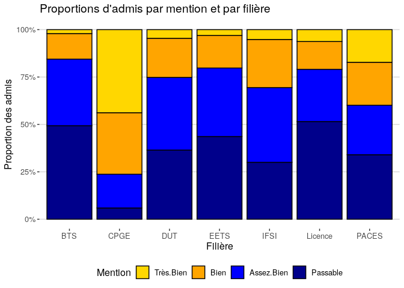<!-- -->


## Taux de type de bac

Le taux de type du bac se défini comme le rapport entre le nombre d'admis néo-bacheliers issus d'un type de bac x, et le nombre d'admis néo-bacheliers :

$bac_x=\frac{admis.néobacheliers.bac_x}{admis.néobacheliers}$


```
## Warning: Removed 192 rows containing non-finite values (stat_boxplot).
```

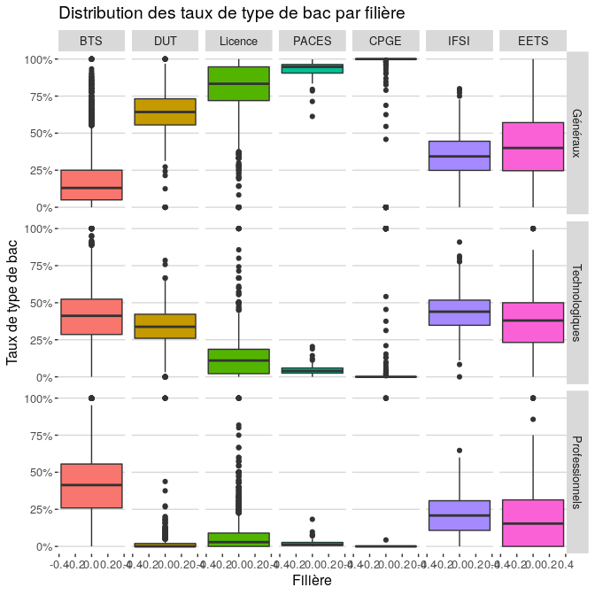<!-- -->


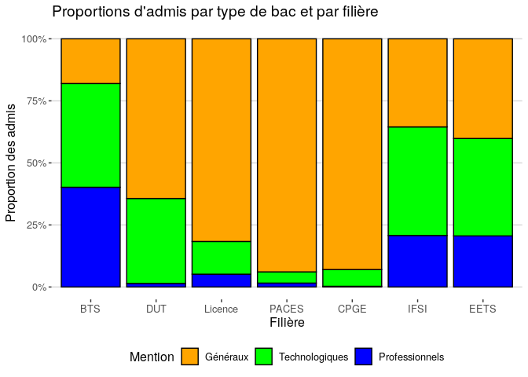<!-- -->


<!-- -->

