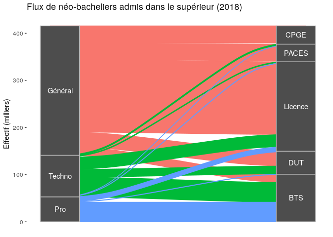
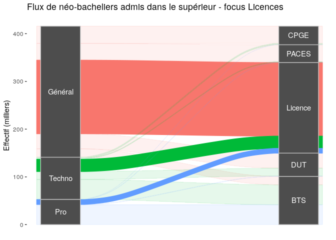
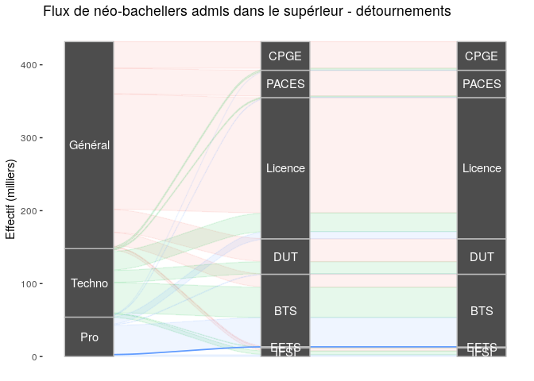
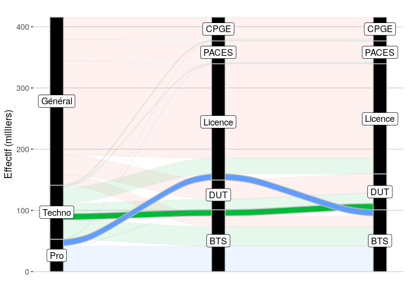
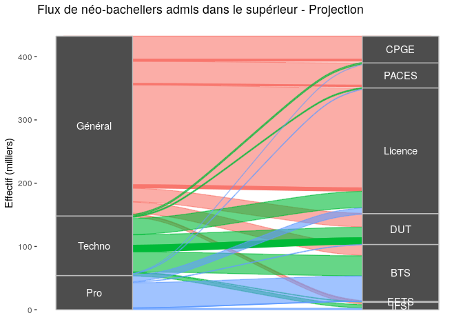

## Situation actuelle

Les flux de néo-bacheliers admis dans le supérieur public peuvent se modéliser ainsi :

<!-- -->

L'un des problèmes actuel du supérieur public est la saturation des Licences, ainsi que leur taux de réussite.

<!-- -->

## Comment améliorer les taux de réussite en Licence à moyens constants ?

Les universités sont formelles : le problèmes des Licences est le taux de réussite des bacs pros. C'est pourquoi ce public est évincé des filières en tension. 

Cette éviction est d'ailleurs le seul levier sûr d'augmentation de la réussite en Licence, [comme cela a été montré en STAPS](http://blog.educpros.fr/julien-gossa/2019/08/10/bilan-2018-2019-i-parcoursup-annee-2/), par exemple.

Les filières les plus adaptées aux bacs pros sont les BTS. On va donc détourner les bacs pros qui allaient en Licence vers les BTS :

<!-- -->

Problème : ce détournement augmente les effectifs en BTS... Or les BTS sont déjà saturés, et on ne souhaite pas ajouter de nouveaux moyens. 

Il faut donc faire de la place. Les bacs généraux sont difficile à gérer, car ils ne font pas l'objet de quotas. On va donc plutôt détourner les flux de bacs technos allant en BTS.

Le taux de réussite des bacs technos dans le supérieur est très bas également : les détourner vers les Licences/PACES/CPGE ne présentera aucun gain de réussite. Leur meilleur taux de réussite est en DUT :

<!-- -->

Maintenant, le problème se situe au niveau du DUT, qui doit absorber 10 milliers de bac technos auparavant en BTS. L'éviction va se faire au niveau des bacs généraux, qui seront ventilés pour 1/3 vers les CPGE (ce qui comble la baisse des effectifs des 3 dernières années) et 2/3 vers les Licences et PACES.

<!-- -->

Au final, on obtient les flux suivants :

<!-- -->

Ainsi, on aura :

- abaissé la pression sur les Licences ;
- enrayé la crise du recrutement en CPGE ;
- augmenté les taux de réussite des bacs pros et des Licences ;

le tout à moyens constants. 

Cependant, cette manœuvre présente deux désavantages majeurs : 

- l'abaissement de la mixité, notamment en BTS ;
- l'abaissement des exigences pédagogiques, et donc de la qualité des diplômes BTS et DUT. 

Détail amusant, cela conduit environ à 50% de bac technologiques en DUT, ce qui est le quota envisagé dans l'Arrêté. 
