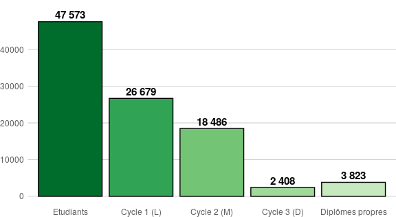

Tableau de bord ESR
================
Julien Gossa
08/01/2020

**ATTENTION : Ceci est un document de travail. Aucune donnée n’a été
vérifiée.**

Téléchargement : [Rapport complet sur les
universités](./tdbesr-rapport.pdf)

# Indicateurs clés de performance (KPI)

Les indicateurs clés de performance choisis sont :

  - Taux de ressources propres : part des ressources propres dans les
    ressources totales de l’établissement.
  - Taux de ressources par étudiant : rapport entre les ressources de
    l’établissement et le nombre d’étudiants inscrits en premier et
    deuxième cycle (L et M).
    <!-- - Taux de formations sélectives : pourcentage de formations post-bac considérées comme sélectives (voir plus bas). -->
  - Taux d’encadrement : nombre d’enseignants titulaires pour 100
    étudiants inscrits en premier et deuxième cycle (L et M).
  - Taux de titularité : pourcentage d’enseignants titulaires parmi tous
    les enseignants.

## Données brutes

Les données brutes ont été extraites des jeux de données suivants :

  - [Principaux établissements d’enseignement supérieur
    (lien)](https://data.enseignementsup-recherche.gouv.fr/explore/dataset/fr-esr-principaux-etablissements-enseignement-superieur/)
      - **UAI** : Unité Administrative Immatriculée
      - **Libellé** et **Sigle**
      - **Type** : université, regroupement ou autre
      - **Type détaillé** : type d’établissement tel qu’il apparait dans
        le jeu de données
      - **Académie**
      - **Rattachement** : établissement de rattachement (regroupement
        et fusions)
      - **Site web**, url **wikidata** et **légifrance**
  - [Indicateurs financiers des opérateurs de l’enseignement supérieur
    français
    (lien)](https://data.enseignementsup-recherche.gouv.fr/explore/dataset/fr-esr-operateurs-indicateurs-financiers/)
      - **Ressources** : *Produits encaissables* dans le jeu de données
      - **Masse salariale** : *Dépenses de personnel* dans le jeu de
        données
      - **Ressources propres** : *Ressources propres / Produits
        encaissables* dans le jeu de données
  - [Statistiques sur les effectifs d’étudiants inscrits par
    établissement public sous tutelle du ministère en charge de
    l’Enseignement supérieur
    (lien)](https://data.enseignementsup-recherche.gouv.fr/explore/dataset/fr-esr-statistiques-sur-les-effectifs-d-etudiants-inscrits-par-etablissement/)
      - **Effectif étudiant** : Nombre d’étudiants inscrits
        (inscriptions principales) hors étudiants inscrits en parallèle
        en CPGE
      - **Nombre d’inscriptions en Cycle 1 (L)** hors étudiants inscrits
        en parallèle en CPGE, inclu les DUT et autres formations
        post-bac
      - **Nombre d’inscriptions en Cycle 2 (M)**
      - **Nombre d’inscriptions en Cycle D (D)**
      - **Nombre d’inscriptions en diplôme d’établissement** : par
        exemple diplôme d’université (DU)
  - [Les enseignants titulaires dans les établissements publics de
    l’enseignement supérieur
    (lien)](https://data.enseignementsup-recherche.gouv.fr/explore/dataset/fr-esr-enseignants-titulaires-esr-public/)
  - [Les enseignants non permanents des établissements publics de
    l’enseignement supérieur
    (lien)](https://data.enseignementsup-recherche.gouv.fr/explore/dataset/fr-esr-enseignants-nonpermanents-esr-public/)
      - **Effectif enseignant** : les vacataires ne sont pas
        comptablisés et les quotités ne sont pas prises en compte
      - **Effectif titulaire**
      - **Enseignant-chercheurs titulaires**
      - **Doctorants et ATER**
      - **Contrats LRU**
  - [APB Voeux de poursuite d’étude et admissions
    (lien)](https://data.enseignementsup-recherche.gouv.fr/explore/dataset/fr-esr-apb_voeux-et-admissions/)
  - [Parcoursup vœux de poursuite d’études et de réorientation dans
    l’enseignement supérieur et réponses des établissements
    (lien)](https://data.enseignementsup-recherche.gouv.fr/explore/dataset/fr-esr-parcoursup/)
      - **Formations Post-Bac** : le nombre de formations post-bac
        proposées par l’établissement
      - **Sélectives** : le nombre de formations dont le rang du dernier
        appelé est inférieur de plus de 10% du nombre de candidats
      - **Hyper-sélectives** : le nombre de formations dont le rang du
        dernier appelé est inférieur de plus de 80% du nombre de
        candidats
      - **Surchargées** : le nombre de formations dont le nombre d’admis
        est supérieur à la capacité d’accueil
      - **Souschargées** : le nombre de formations dont le nombre
        d’admis est inférieur à 75% de la capacité d’accueil

*NB* : les données APB/Parcoursup sont particulièrement difficile à
exploiter et comportent de nombreux trous. De plus, elles concernent
deux plateformes différentes (APB puis Parcoursup), avec des changements
legislatifs et pratiques profonds. Les indicateurs ont ne sont pas
présentés dans cette version pour éviter d’induire le lecteur en
erreur.

Enfin, afin de pouvoir présenter les données, les series ont été
décalées d’un an (i.e. les données d’admission post-bac notée à
l’année 2017 sont celles de la rentrée
2018).

## Exemples de lecture

### KPI : instantanés

Exemple de lecture : « Il y a en moyenne 4,1 enseignants titulaires pour
100 étudiants dans les universités. Dans cet établissement, il y en a
3,7, ce qui le place dans le deuxième quartile
».

### KPI : évolution en valeur absolue

Exemple de lecture : « En 2012, le taux d’encadrement de l’établissement
était à 4,3, soit la médiane pour toutes les universités. Il est
progressivement passé à 3,7, ce qui place maintenant l’établissement
dans le deuxième quartile
».

#### KPI : évolution en valeur de l’année de référence

Exemple de lecture : « Entre 2012 et 2017, le taux d’encadrement de
l’établissement a baissé d’environ 15%, ce qui le place dans le
premier quartile inférieur des évolution de cet indicateur
».

#### Données brutes

Exemple de lecture : « l’établissement compte 47 573 étudiants hors
double inscription en CPGE, dont 26 679 en 1er cycle (L, DUT, prépa,
etc.)
».

#### Données normalisées

Exemple de lecture : « La part moyenne des étudiants en 1er cycle dans
les effectifs des universités est de 68%. L’établissement présente une
part de 56%, ce qui le place dans le quartile inférieur ».
